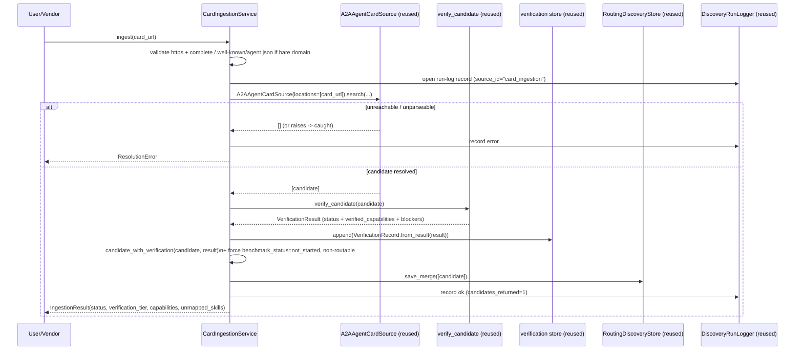

# Design Document

## Overview

Card_Ingestion is a thin coordination layer that turns a submitted agent-card URL (any domain) into a verified, indexed `DiscoveryCandidate`. The decisive design fact is that **almost every part already exists** — this feature is wiring, not new machinery:

| Need | Existing component reused | Source of truth |
|---|---|---|
| Fetch + parse an A2A card URL | `A2AAgentCardSource` (its `_load_json` already fetches `http(s)` URLs and `_candidate_from_agent_card` parses skills/auth/provider) | `discovery/sources/a2a.py` |
| Normalize into a candidate | `normalize_candidate` (invoked inside `A2AAgentCardSource.search`) | `discovery/normalizer.py` |
| Existence + claim verification | `verify_candidate` (already reads A2A `skills` / MCP `tools` from the evidence URL) | `discovery/verification.py` |
| Persist a verification check | `VerificationRecord.from_result` + `verification_store_for_path` | `discovery/verification_store.py` |
| Apply verification to the candidate | `candidate_with_verification` | `discovery/verification.py` |
| Parse declared skills → operations | `DescriptorReader` | `eval/descriptor.py` |
| Store the candidate (agentic partition) | `RoutingDiscoveryStore` via `discovery_store_for_path` + `save_merge` (dedupe) | `discovery/store.py`, `discovery/dedupe.py` |
| Audit the ingestion attempt | `DiscoveryRunLogger.record` | `discovery/run_log.py` |
| Trust ceiling (no quality overclaim) | the existing trust ladder + promotion gate + credibility `_is_real_run` deny-list | `discovery/normalizer.py`, `benchmark/credibility.py` |

So the new code is essentially: **a small `CardIngestionService` that orchestrates these calls in order**, plus a CLI/route entry. No new parsing, no new verification, no new persistence, no new normalization.

The A2A quality-attestation gap is **not** built here. It is tracked as blocked-on-invocation: a request for quality attestation returns a structured blocked result and is documented in the tracking docs, and when A2A invocation lands it routes through the existing `EvalFramework` (Requirement 7).

## Design decisions and rationale

1. **Reuse `A2AAgentCardSource` as the resolver — do not write a new fetcher/parser.** It already accepts a `locations` list of file paths *or* URLs, fetches them, and normalizes each card into a `DiscoveryCandidate`. Card_Ingestion constructs it with a single-element `locations=[card_url]` and reads back the one candidate. This is the single most important reuse decision: card parsing already exists and is tested.

2. **Reuse `verify_candidate` for existence + claim verification — do not write new verification.** It already fetches the evidence URL, reads the A2A `skills` array (and MCP `tools`), intersects declared vs. evidenced capabilities, and returns `capability_verified` / `known_provider` / `unverified` with blockers. That is exactly existence-and-claim verification. Card_Ingestion calls it and persists the `VerificationRecord` via the existing store.

3. **Honest trust ceiling is structural, not new policy.** Card_Ingestion never sets `benchmark_status` beyond `not_started` and never sets `route_status` to routable. The existing promotion gate (`dedupe._promoted_candidate` requires adapter + passed benchmark + ready-for-promotion) keeps the agent non-routable, and the existing credibility classifier keeps it out of any quality leaderboard because no real benchmark run exists. We add nothing to enforce the ceiling — we simply do not write quality fields.

4. **Generalizable by construction.** Because the submitter supplies the URL, there is no enumeration problem: any domain works. The conventional `/.well-known/agent.json` completion (Requirement 1.4) is a convenience for bare-domain submissions, applied only to the submitted domain — it is not a crawler.

5. **Safety via the resolver's own bounds + a thin guard.** `_load_json` already uses a timeout and `urllib` (no automatic cross-origin credential leakage). Card_Ingestion adds a response-size cap and an `https`-only + same-host check before delegating, so a malicious submission cannot pull unrelated resources.

6. **Quality attestation routes through `EvalFramework` when unblocked.** When A2A invocation exists, attestation is `EvalFramework.evaluate_cell(candidate, capability, run_mode=...)` — the path already built in the agent-eval-framework spec. Card_Ingestion does not grow its own scoring path.

## Architecture

```mermaid
graph TD
    SUB[Submission: card URL + optional metadata]
    subgraph CardIngestion["Card_Ingestion (new: discovery/card_ingestion.py)"]
        SVC[CardIngestionService.ingest]
        GUARD[url guard: https-only, size cap, well-known completion]
    end
    subgraph Existing["Existing components (reused, unchanged)"]
        A2A[A2AAgentCardSource\nfetch + parse + normalize]
        DESC[DescriptorReader\nskills -> operations]
        VER[verify_candidate\nexistence + claim]
        VAPPLY[candidate_with_verification]
        VREC[VerificationRecord + verification store]
        STORE[RoutingDiscoveryStore.save_merge]
        RUNLOG[DiscoveryRunLogger.record]
    end
    BLOCK[Quality attestation -> blocked_on_invocation\n(routes to EvalFramework when A2A invocation ships)]

    SUB --> SVC
    SVC --> GUARD
    GUARD --> A2A
    A2A --> DESC
    A2A --> VER
    VER --> VAPPLY
    VER --> VREC
    VAPPLY --> STORE
    SVC --> RUNLOG
    SVC -. quality requested .-> BLOCK
```

### Ingestion sequence



## Components and Interfaces

### CardIngestionService — `discovery/card_ingestion.py` (the only substantial new module)

```python
@dataclass
class IngestionResult:
    provider_id: str
    card_url: str
    resolved: bool
    verification_status: str           # canonical trust-ladder value
    verified_capabilities: list[str]
    declared_capabilities: list[str]
    unmapped_skills: list[str]
    blockers: list[str]
    benchmark_status: str = "not_started"   # always; never a quality claim
    routable: bool = False                  # always False on ingest
    error: str = ""

    def to_json(self) -> dict[str, Any]: ...


@dataclass
class CardIngestionService:
    discovery_store_url: str
    verification_store_url: str
    run_logger: object | None = None        # DiscoveryRunLogger | None -> default
    timeout_seconds: float = 10.0
    max_card_bytes: int = 1_000_000

    def ingest(self, card_url: str) -> IngestionResult: ...
    def attest_quality(self, provider_id: str, capability: str) -> dict: ...  # blocked (R7)
```

Responsibilities (each delegates to an existing component):
- **Validate + normalize the URL** (R1.3, R1.4, R6.3): require `https://`; if the URL has no path or only `/`, append `/.well-known/agent.json`. Reject non-https.
- **Resolve** (R1.5, R2.x): build `A2AAgentCardSource(locations=[card_url], source_id="card_ingestion")`, call `.search(capabilities=set(), task_description="")`, take the single candidate. The size cap and timeout are enforced via a thin wrapper around the source's fetch (see "Safety" below). The candidate's evidence URL is the submitted URL (the source already sets `evidence_url` from the card).
- **Extract claims** (R2.3, R2.4): run `DescriptorReader().read(candidate)`; record `unmapped_operations` as `unmapped_skills`. (Capabilities themselves already come from the card via `normalize_candidate`; the reader adds the unmapped report.)
- **Verify** (R3.x): `verify_candidate(candidate)`; persist `VerificationRecord.from_result(result)` via `verification_store_for_path(self.verification_store_url).append([...])`; apply via `candidate_with_verification(candidate, result)`.
- **Enforce the honest ceiling** (R4.x): force `benchmark_status="not_started"` and leave `route_status="will_fail"` / `will_fail=True` (a freshly resolved candidate is already non-routable; we assert it explicitly so a future card field can't smuggle a routable flag).
- **Persist** (R5.x): `discovery_store_for_path(self.discovery_store_url).save_merge([candidate])` — the routing facade sends the `a2a_agent`/`mcp_server` row to the agentic store, and `save_merge` dedupes on re-submit using the existing `dedupe_key`/`merge_candidates`.
- **Audit** (R5.4): wrap the attempt in `DiscoveryRunLogger.record(source_id="card_ingestion", ...)`.
- **Quality attestation** (R7): `attest_quality` returns `{"status": "blocked_on_invocation", "source": "refused", "reason": "A2A invocation not implemented; routes through EvalFramework when available"}`. `source="refused"` is already in the credibility `_is_real_run` deny-list (added by the eval framework), so it can never read as a real run.

### Entry points (reuse existing conventions)

- **CLI** `scripts/discovery/run_card_ingestion.py` — mirrors `run_discovery.py` scaffolding (path insert → argparse `--card-url` → resolve stores via `discovery_store_for_path` / `verification_store_for_path` → JSON summary → exit 0). Make target `card-ingest`.
- **(Optional, deferred) HTTP route** — a `/discovery/submit-card` endpoint can wrap the same service later; not required for the core feature and intentionally out of scope here to avoid touching the FastAPI app.

### What is explicitly NOT added

- No new fetcher/parser (uses `A2AAgentCardSource`).
- No new verification logic (uses `verify_candidate`).
- No new candidate/verification store (uses `RoutingDiscoveryStore` + `verification_store_for_path`).
- No new normalization (uses `normalize_candidate`).
- No new scoring/quality path (defers to `EvalFramework` when A2A invocation exists).
- No `.well-known` *crawler* — only completion of a submitted bare domain (it is not discovery).

## Data Models

No new persisted schema. Card_Ingestion writes through existing schemas:
- `DiscoveryCandidate` (agentic row via `RoutingDiscoveryStore`).
- `VerificationRecord` (existing `verification_records`).
- `DiscoveryRunEvent` (existing run-log).

`IngestionResult` is a transient return type (not persisted) summarizing the outcome for the CLI/caller.

## Safety and security

- **https-only** submitted URL; reject everything else (R1.3, R6.3).
- **Same-host bound**: only the submitted host (and its `/.well-known/agent.json`) is fetched. We pass exactly one location to `A2AAgentCardSource`; we never follow card-embedded URLs to fetch further resources during ingest (R6.3).
- **Timeout** via the source's `timeout_seconds` (R6.1, R6.2). Fetch failures already return `[]`/raise inside `_load_json` → caught → structured `ResolutionError` (R6.2).
- **Size cap** (R6.4): a thin read-limit wrapper; if the existing `_load_json` does not expose a byte cap, Card_Ingestion fetches via a bounded reader and hands the parsed dict to the source's normalizer rather than letting an unbounded body load. (Implementation detail in tasks; no parser rewrite — only the read is bounded.)
- **No credential persistence** (R6.5): submission metadata credentials, if any, are used only for the fetch and never written to the candidate, verification record, or run log.

## Honesty invariants (mapped to the trust ladder)

| Outcome | Persisted state | Why it can't overclaim |
|---|---|---|
| Card reachable + skills advertised | `verification_status` ∈ {`capability_verified`,`known_provider`,`registered_in_directory`}, `benchmark_status="not_started"`, non-routable | No benchmark run exists; credibility classifier can't show it as quality-scored |
| Card unreachable / unparseable | no candidate persisted, structured error | nothing enters the index |
| Quality attestation requested (A2A) | `blocked_on_invocation`, `source="refused"` (non-real) | deny-listed by `_is_real_run`; never a real run |

## Error Handling

| Condition | Behavior | Requirement |
|---|---|---|
| Non-https submitted URL | `IngestionResult(resolved=False, error="non_https_url")`, no fetch | R1.3, R6.3 |
| Bare domain submitted | complete to `/.well-known/agent.json`, then resolve | R1.4 |
| Card unreachable / timeout | caught from `A2AAgentCardSource`/`_load_json`, `IngestionResult(resolved=False, error="resolution_failed")`, no candidate | R6.1, R6.2 |
| Card oversized | bounded read aborts, structured resolution error | R6.4 |
| Card parses but no skills/capabilities | `normalize_candidate` raises `CandidateNormalizationError` → caught → resolution error | R2.2 |
| Verification fails | candidate indexed at `unverified`, blockers recorded | R3.5 |
| Re-submission of same URL | `save_merge` dedupes; one merged candidate | R5.3 |
| Quality attestation requested (A2A) | `attest_quality` → `blocked_on_invocation`, `source="refused"` | R7.1, R7.2 |

Every `ingest` path returns an `IngestionResult`; no fetch failure propagates as an unhandled exception (Property 7).

## Correctness Properties

### Property 1: Reuse-only — no duplicated machinery
Card_Ingestion resolves, verifies, normalizes, and persists exclusively through the named existing components; it introduces no parallel fetcher, parser, verifier, candidate store, or verification store.

**Validates: Requirements 1.5, 3.4, 5.5**

### Property 2: Generalizes to any domain
For any `https` card URL on any domain, ingestion proceeds without requiring that domain to be pre-registered; resolution success depends only on the card being reachable and parseable.

**Validates: Requirements 1.1, 1.2**

### Property 3: No quality overclaim from a card
For every ingested candidate, `benchmark_status == "not_started"` and the candidate is non-routable; no Agent_Card alone produces a quality/benchmark status or a routable state.

**Validates: Requirements 4.1, 4.2, 4.3**

### Property 4: Verification tier never exceeds evidence
The persisted `verification_status` is exactly the value `verify_candidate` returns for the resolved candidate; Card_Ingestion never raises it above what the evidence supports.

**Validates: Requirements 3.2, 3.3**

### Property 5: A2A quality attestation is structurally blocked and non-real
`attest_quality` for an A2A agent returns a blocked result whose `source` is in the credibility classifier's non-real deny set, so the agent can never appear as quality-scored.

**Validates: Requirements 7.1, 7.2, 7.3**

### Property 6: Idempotent re-submission
Submitting the same card URL more than once results in one merged candidate (via the existing dedupe/merge path), never duplicates.

**Validates: Requirements 5.3**

### Property 7: Total failure handling
`ingest` returns an `IngestionResult` (resolved or error) for every input and never propagates an unhandled exception from an unreachable/timed-out/oversized fetch.

**Validates: Requirements 6.2, 6.4**

## Testing Strategy

Stdlib `unittest`; no network in the default suite (reuse the existing in-process HTTP stub pattern from `tests/fixtures/`).

**Unit (no network):**
- URL guard: non-https rejected; bare domain → `/.well-known/agent.json`; size-cap path.
- Resolver reuse: a stub server serving an A2A card → `A2AAgentCardSource` produces the candidate; assert evidence URL = submitted URL and capabilities derive from `skills`.
- Verification reuse: `verify_candidate` against the stub card → `capability_verified`; `VerificationRecord` appended to a temp JSON store.
- Honest ceiling: ingested candidate has `benchmark_status == "not_started"` and `will_fail is True`.
- Unmapped skills: a card skill with no registry-capability overlap is reported in `unmapped_skills`, not fabricated.
- Idempotency: ingest the same URL twice → store has one row.
- Failure isolation: unreachable URL → `IngestionResult(resolved=False, error=...)`, no exception, no candidate.
- Blocked attestation: `attest_quality` returns `source="refused"`; assert `credibility._is_real_run` treats it as non-real.

**Integration:**
- End-to-end with the existing MCP/A2A stub server: submit card URL → candidate lands in the agentic store via `RoutingDiscoveryStore`, a `VerificationRecord` is persisted, and a run-log event is recorded.
- Cross-check: an `api_provider`-shaped card never lands in `discovery_candidates` (routing facade sends it away) — guards Requirement 5.2.

## Requirements coverage map

| Requirement | Primary design element |
|---|---|
| R1 Submit by URL (any domain) | `CardIngestionService.ingest` URL guard + `A2AAgentCardSource` resolver |
| R2 Resolve + normalize | `A2AAgentCardSource` + `normalize_candidate` + `DescriptorReader` |
| R3 Existence + claim verification | `verify_candidate` + `VerificationRecord` + `candidate_with_verification` |
| R4 Honest trust ceiling | force `not_started` + non-routable; existing promotion gate + credibility classifier |
| R5 Persistence/integration | `RoutingDiscoveryStore.save_merge` + `DiscoveryRunLogger` |
| R6 Idempotency/safety | https-guard + size cap + timeout + `save_merge` dedupe |
| R7 A2A quality blocked-on-invocation | `attest_quality` → `source="refused"`; routes to `EvalFramework` when unblocked; tracked in docs |
