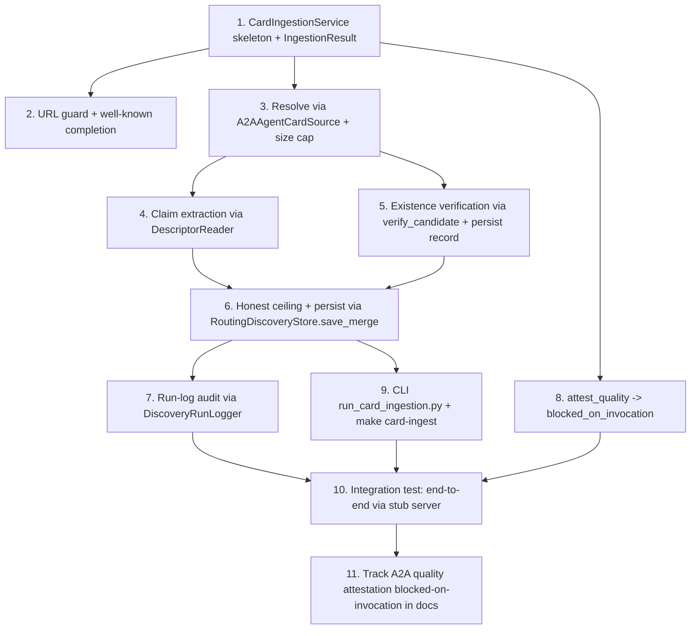

# Implementation Plan

## Overview

This plan wires a user/vendor-submitted agent-card ingestion path that works for any domain, reusing existing components end-to-end (`A2AAgentCardSource`, `verify_candidate`, `VerificationRecord` + verification stores, `RoutingDiscoveryStore`, `DescriptorReader`, `DiscoveryRunLogger`). The only substantial new module is a thin `CardIngestionService` orchestrator. A2A quality attestation is NOT built — it is tracked as blocked-on-invocation and routes through the existing `EvalFramework` when that surface ships. Conventions: stdlib `unittest` (no pytest), Ruff-clean, no new third-party deps, no parallel stores.

## Task Dependency Graph



```json
{
  "waves": [
    { "wave": 1, "tasks": ["1"], "rationale": "Service skeleton + transient IngestionResult model; nothing else can wire without it." },
    { "wave": 2, "tasks": ["2", "3", "8"], "rationale": "URL guard, resolver reuse, and the blocked attestation are independent of each other once the skeleton exists." },
    { "wave": 3, "tasks": ["4", "5"], "rationale": "Claim extraction and existence verification both consume the resolved candidate from task 3." },
    { "wave": 4, "tasks": ["6"], "rationale": "Honest ceiling + persistence depends on both claim extraction and verification." },
    { "wave": 5, "tasks": ["7", "9"], "rationale": "Run-log audit and the CLI both depend on the persistence path." },
    { "wave": 6, "tasks": ["10"], "rationale": "End-to-end integration test depends on the full path + CLI + blocked attestation." },
    { "wave": 7, "tasks": ["11"], "rationale": "Docs tracking of the blocked A2A attestation, done once the code path and its limits are real." }
  ]
}
```

## Tasks

- [x] 1. Add the CardIngestionService skeleton and IngestionResult model
  - Create `apps/api/planmyagents_api/discovery/card_ingestion.py` with `IngestionResult` (transient, with `to_json()`) and `CardIngestionService` exactly as in the design's Components section, with `ingest()` and `attest_quality()` stubs.
  - Do NOT add any new store/parser/verifier — fields hold store URLs that resolve via existing `discovery_store_for_path` / `verification_store_for_path`.
  - Unit test `apps/api/tests/discovery/test_card_ingestion.py`: `IngestionResult.to_json()` round-trips; service constructs with store URLs.
  - _Requirements: 5.5_

- [x] 2. Implement the URL guard and well-known completion
  - In `ingest()`, require `https://`; reject otherwise with `error="non_https_url"`. If the URL path is empty or `/`, append `/.well-known/agent.json` (submitted-domain only; not a crawler).
  - Tests: non-https rejected; bare domain completes to `/.well-known/agent.json`; full URL passes through unchanged.
  - _Requirements: 1.1, 1.2, 1.3, 1.4, 6.3_

- [x] 3. Resolve the card via A2AAgentCardSource with a bounded read
  - In `ingest()`, construct `A2AAgentCardSource(locations=[card_url], source_id="card_ingestion", timeout_seconds=...)` and read back the single candidate. Reuse its parsing — do NOT write a new fetcher/parser.
  - Enforce a response-size cap (`max_card_bytes`) by bounding the read before parse; on unreachable/oversized/unparseable, return `IngestionResult(resolved=False, error=...)` — never raise.
  - Set the candidate's evidence URL to the submitted URL (the source already does this from the card; assert it).
  - Tests (in-process stub server from `tests/fixtures/`): valid A2A card → candidate with capabilities derived from `skills`; unreachable URL → resolved=False, no exception; oversized body → structured error.
  - _Requirements: 1.5, 2.1, 2.2, 2.5, 6.1, 6.2, 6.4_

- [x] 4. Extract declared-skill claims via DescriptorReader
  - Run `DescriptorReader().read(candidate)`; populate `IngestionResult.declared_capabilities` and `unmapped_skills` (from `unmapped_operations`). Do NOT fabricate registry capabilities for unmapped skills.
  - Tests: a card skill overlapping a registry capability is NOT unmapped; a non-overlapping skill IS reported in `unmapped_skills`; candidate capability set unchanged.
  - _Requirements: 2.3, 2.4_

- [x] 5. Run existence verification and persist the record (reuse)
  - Call `verify_candidate(candidate)`; build `VerificationRecord.from_result(result)` and append via `verification_store_for_path(self.verification_store_url)`. Apply with `candidate_with_verification(candidate, result)`. Reuse only — no new verification logic or store.
  - Set `IngestionResult.verification_status`, `verified_capabilities`, `blockers` from the result.
  - Tests: stub card with advertised skills → `capability_verified`; verification record appended to a temp JSON store; failed verification → `unverified` + blockers recorded.
  - _Requirements: 3.1, 3.2, 3.3, 3.4, 3.5_

- [x] 6. Enforce the honest ceiling and persist via the routing facade
  - Force `benchmark_status="not_started"` and keep the candidate non-routable (`route_status="will_fail"`, `will_fail=True`) regardless of card contents. Persist via `discovery_store_for_path(self.discovery_store_url).save_merge([candidate])`.
  - Confirm the agentic candidate lands in the agentic store (not `apis_without_agents`) and that re-submission merges (no duplicate) through the existing dedupe path.
  - Tests: ingested candidate has `benchmark_status == "not_started"` and `will_fail is True`; ingest same URL twice → one row; an `api_provider`-shaped card never lands in `discovery_candidates`.
  - _Requirements: 4.1, 4.2, 4.3, 4.4, 4.5, 5.1, 5.2, 5.3_

- [x] 7. Record the ingestion attempt in the existing run-log
  - Wrap the ingest attempt in `DiscoveryRunLogger.record(source_id="card_ingestion", ...)` so success/failure + candidate count are audited through the existing run-log. Never persist a submitted credential to the run-log.
  - Tests: a run-log event is recorded for a successful ingest and for a failed resolution; no credential value appears in the event.
  - _Requirements: 5.4, 6.5_

- [x] 8. Implement attest_quality as blocked-on-invocation
  - `attest_quality(provider_id, capability)` returns `{"status": "blocked_on_invocation", "source": "refused", "reason": "A2A invocation not implemented; routes through EvalFramework when available"}`.
  - Tests: returns `source="refused"`; assert `benchmark.credibility._is_real_run({"source": "refused", "sample_size": 1})` is False (can never read as a real run).
  - _Requirements: 7.1, 7.2, 7.3, 7.4_

- [x] 9. Add the CLI and make target
  - Create `scripts/discovery/run_card_ingestion.py` mirroring `scripts/discovery/run_discovery.py` scaffolding: argparse `--card-url`, resolve stores from env/flags, call `CardIngestionService.ingest`, print JSON summary, exit 0.
  - Add `make card-ingest` (passes `CARD_URL=...`). Add the target to `.PHONY`.
  - Tests: CLI resolves a stub card URL end-to-end and prints a JSON summary with the verification tier; exit 0 on unreachable URL (structured error, idempotent).
  - _Requirements: 1.1, 5.1_

- [x] 10. End-to-end integration test
  - Using the in-process stub server, submit a card URL → assert candidate lands in the agentic store via `RoutingDiscoveryStore`, a `VerificationRecord` is persisted, a run-log event is recorded, `benchmark_status == "not_started"`, and the agent is non-routable.
  - Assert the full path raises no unhandled exception on any input (resolved or error).
  - _Requirements: 2.1, 3.1, 4.1, 5.1, 6.2_

- [x] 11. Track A2A quality attestation as blocked-on-invocation in docs
  - Record the blocked-on-invocation status in `docs/honest-scope-audit.md` and `sprint.md`: card ingestion delivers existence + claim verification for any domain; A2A quality attestation remains blocked until A2A invocation is wired into `agents/protocol.py`, at which point it routes through `EvalFramework`.
  - Cross-link the agent-eval-framework spec's A2A `refusal_only` status so the two specs stay consistent. Do not overclaim on any surface.
  - _Requirements: 7.5_

## Notes

- This feature is integration, not new machinery: the only substantial new file is `card_ingestion.py`. Card parsing (`A2AAgentCardSource`), verification (`verify_candidate`), persistence (`RoutingDiscoveryStore`, verification stores), normalization (`normalize_candidate`), and claim extraction (`DescriptorReader`) are all reused unchanged.
- The `.well-known` completion is for a submitted bare domain only — it is a resolution convenience, NOT a discovery crawler. Discovery of unknown agents on unknown domains remains an unsolved, out-of-scope problem.
- A2A quality attestation stays blocked: a self-asserted card claim is verified as *made* (existence/claim), never as *true* (quality). Quality requires invocation + ground truth and routes through `EvalFramework` once A2A invocation exists.
- Reuse the existing `tests/fixtures/` in-process stub server pattern; no network in the default suite.
