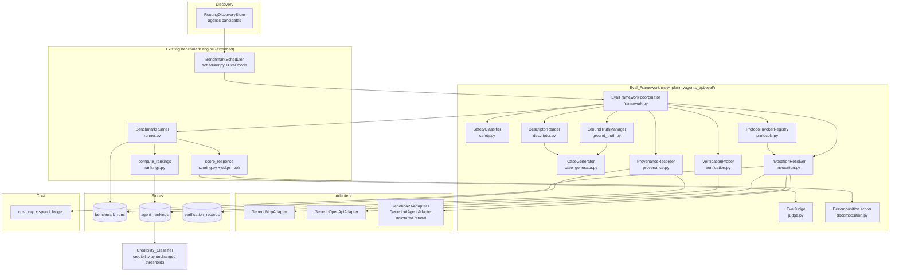
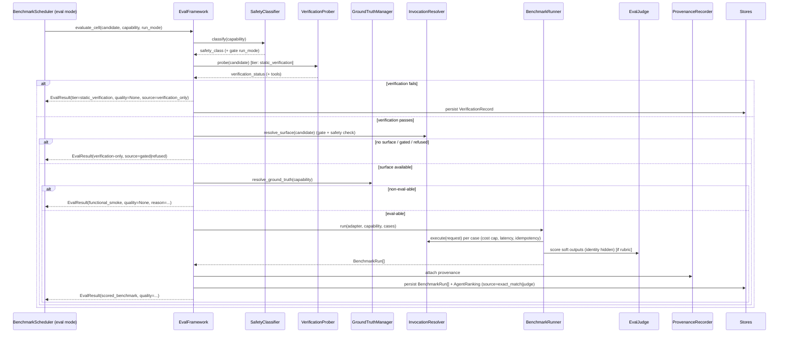

# Design Document

## Overview

The Agent Evaluation Framework (the "Eval_Framework") is a coordination layer that turns a discovered agentic candidate into honest, provenance-bearing performance evidence and feeds that evidence into the stores the credibility surface already reads (`benchmark_runs`, `agent_rankings`, `verification_records`). It is the piece that closes the gap named in `docs/honest-scope-audit.md`: today nothing scores a *discovered* agent; the only real scores come from hand-coded API baselines that are firewalled out of routing, so `benchmark/credibility.py` reports every leaderboard as `synthetic_only`.

The design is deliberately **additive and integrative, not parallel**. It reuses the existing benchmark engine end-to-end:

- `benchmark/runner.py` (`BenchmarkRunner`) — still executes cases against an adapter.
- `benchmark/scoring.py` (`score_response`) — still does exact-match field scoring; we extend it with a judge path for soft outputs.
- `benchmark/rankings.py` (`compute_rankings`, `AgentRanking`) — still aggregates runs into a ranking with a `source` tag.
- `benchmark/credibility.py` (`classify`) — **unchanged thresholds**; we only extend its non-real `source` denylist (`_is_real_run`) with eval-specific synthetic tags. No threshold edits.
- `benchmark/scheduler.py` (`BenchmarkScheduler`) — extended (not replaced) so it can resolve and evaluate discovered MCP/OpenAPI candidates through the generic protocol adapters instead of skipping them as `protocol_beta`.
- `agents/protocol.py` — the executable invocation surface (`GenericMcpAdapter`, `GenericOpenApiAdapter`) and the honest refusals (`GenericA2AAdapter`, `GenericAiAgentAdapter`).
- `cost/cost_cap.py`, `cost/spend_ledger.py` — the budget enforcement.

The central design insight is that **the four eval tiers map one-to-one onto the four credibility bands the classifier already produces.** Getting the tiers right means the credibility classifier "just works" with no new grading logic:

| Eval tier | What it does | What it persists | Credibility band it produces |
|---|---|---|---|
| `static_verification` | Probe existence (MCP `tools/list`) | `VerificationRecord`; **no** scored ranking | `synthetic_only` (0 real ranking rows) |
| `functional_smoke` | A few real invocations, success-only scoring | Real `BenchmarkRun`s, small N | `smoke_test` (real but < min providers/samples) |
| `scored_benchmark` | Full curated case set vs ground truth | Real `BenchmarkRun`s, N≥30, ≥3 providers | `developing` → `publishable` |
| `continuous_reeval` | Re-run on freshness schedule | Refreshes `last_run_at` | keeps a cell `publishable` |

This is why the framework does not need to touch credibility thresholds: the honesty is enforced by *what tier produced the data*, expressed through `source`, `sample_size`, and `last_run_at` — exactly the three signals the classifier already inspects.

## Design decisions and rationale

1. **Reuse `benchmark/scheduler.py`; do not fork it.** Requirement 8.4 is explicit, and the scheduler already has the failure-isolation, retag-by-candidate, and status-aggregation behavior the eval batch needs (Requirement 12). We extend its `_resolve_adapter` to consult the eval `InvocationResolver` + `SafetyClassifier`, and add run-mode/tier parameters to `run()`. Backward compatibility is preserved by defaulting the new parameters to today's behavior.

2. **`source` carries the eval basis; provenance carries the rest.** The credibility classifier reads only `source`, `sample_size`, `last_run_at` off a ranking. To satisfy Requirement 4.6 (judge basis must be distinct from exact-match) and Requirement 7.1 (synthetic must be non-real) without changing thresholds, we define a small `source` taxonomy (below) and put everything else (case-set version, ground-truth version, run mode, agent version, tier, judge model, rubric version) into an `EvalProvenance` block stored on `BenchmarkRun.raw_response["_eval"]` and mirrored onto a new **optional** `AgentRanking.provenance` field (defaults to `{}`, backward compatible).

3. **Verification-only is absence, not zero.** Requirement 2.2 requires "not scored" to be distinguishable from "scored zero." A `static_verification` result therefore produces a `VerificationRecord` and **never** an `AgentRanking` with `quality=0`. `EvalResult.quality_score` is `Optional[float]` and is `None` for verification-only.

4. **The only allowed classifier change is extending the denylist.** Requirement 8.2 forbids modifying thresholds. We add `verification_only`, `dry_run`, `gated`, `refused` to `credibility._is_real_run`'s non-real `source` set. This is a denylist widening, not a threshold change, and it is the safe direction (it can only ever mark *fewer* things real).

5. **Cheapest-first, fail-closed.** Tiers attempt in order; a failed cheaper tier stops the ladder (Requirement 6.3). Any provider call that errors, times out, is gated, or trips the cost cap becomes a structured `EvalResult`, never an exception (Requirements 11, 12, 14).

6. **Side-effect safety is a precondition, not an afterthought.** The `SafetyClassifier` runs before any `live`/`sandbox` call. `unclassified` ⇒ only `dry_run`. `side_effecting` without an approval record ⇒ no `live`. `side_effecting` evaluated in `sandbox` ⇒ synthetic fixtures only (`@resend.dev`, RFC-2606 domains, test keys) (Requirement 5).

7. **The agent's own capability descriptor drives test generation; we do not test a hand-mapped slug in isolation.** A discovered agent advertises what it can do — MCP via `tools/list`, A2A via the Agent Card `skills` array, OpenAPI via its operation set. The `DescriptorReader` parses whichever descriptor a protocol exposes into one normalized `OperationSpec` shape, and the `CaseGenerator` derives case inputs from that. This is what makes the framework apply "broadly to all discovered agents": the test surface comes from the agent, not from a per-capability hardcode (Requirement 15).

8. **Protocol invocation is a plugin registry with an honest maturity status, not a hardcoded `if mcp / elif openapi`.** The `ProtocolInvokerRegistry` maps a candidate's protocol to a `ProtocolInvoker`. MCP and OpenAPI are `executable` today; A2A, ACP, and ANP are registered with a non-`executable` maturity status (`refusal_only` / `planned`) so they produce verification-only results and never a fabricated score until a real invoker plus tests exist. Adding a protocol is registering an invoker — the coordinator, scheduler, and scoring path do not change (Requirement 16). This directly reflects the current protocol landscape: ACP has merged into A2A under the Linux Foundation, and ANP is DID/JSON-LD-based open-network discovery; neither has a stable invocation surface we can honestly score yet.

9. **Scoring follows the field-standard tool-use decomposition, additively.** Beyond pass/fail and exact-match field scoring, every tool/operation call is also scored along the four-step decomposition (decide-to-call, select-operation, build-arguments, integrate-result) and retains a trajectory so a failure is locatable. The composite quality score persisted to `agent_rankings` stays on the same 0.0–1.0 scale the classifier already consumes; the decomposition is additive diagnostic metadata, so no classifier threshold changes (Requirement 17).

### Protocol maturity status (current)

| Protocol | Descriptor read | Invoker status | Eval outcome today |
|---|---|---|---|
| MCP | `tools/list` schema | `executable` (`GenericMcpAdapter`) | scored runs |
| OpenAPI | operation set | `executable` (`GenericOpenApiAdapter`) | scored runs |
| A2A | Agent Card `skills` | `refusal_only` (spec in flux) | verification-only |
| ACP | (merged into A2A under Linux Foundation) | `planned` | verification-only |
| ANP | DID + JSON-LD capability doc | `planned` | verification-only |

The status column is the single source of truth the registry consults; promoting a protocol is a one-line registry change plus an invoker implementation and its tests (Requirement 16.7).

## Architecture



### Evaluation sequence for one eval cell



## Components and Interfaces

All new code lives in a new package `apps/api/planmyagents_api/eval/`. Modules are stdlib + existing deps only (no new third-party packages; tests stay on stdlib `unittest`).

### EvalFramework (coordinator) — `eval/framework.py`

Single entry point per eval cell. Owns tier ordering, degradation, and result assembly.

```python
@dataclass
class EvalFramework:
    safety: SafetyClassifier
    prober: VerificationProber
    ground_truth: GroundTruthManager
    invocation: InvocationResolver
    runner: BenchmarkRunner
    provenance: ProvenanceRecorder

    def evaluate_cell(
        self,
        *,
        candidate: DiscoveryCandidate,
        capability: str,
        run_mode: EvalRunMode = EvalRunMode.DRY_RUN,
    ) -> EvalResult: ...
```

Responsibilities and requirement coverage:
- Reject non-agentic provider types with a descriptive error (R1.7).
- Run the tier ladder cheapest-first, stop on cheaper-tier failure (R6.2, R6.3).
- Degrade to verification-only with absent quality when no surface / no ground truth (R1.3, R2.x).
- Record provider type, tier reached, run mode, safety class on every result (R1.5, R5.8, R6.7).

### SafetyClassifier — `eval/safety.py`

```python
class SafetyClass(str, Enum):
    READ_ONLY = "read_only"
    SIDE_EFFECTING = "side_effecting"
    UNCLASSIFIED = "unclassified"

@dataclass(frozen=True)
class SafetyApproval:
    capability: str
    fixture_spec: dict[str, Any]   # e.g. {"recipient_domain": "resend.dev"}
    approved_by: str
    approved_at: str

@dataclass
class SafetyClassifier:
    approvals: dict[str, SafetyApproval]
    overrides: dict[str, SafetyClass] = field(default_factory=dict)

    def classify(self, capability: str) -> SafetyClass: ...
    def permitted_run_modes(self, capability: str) -> set[EvalRunMode]: ...
    def fixture_for(self, capability: str) -> dict[str, Any] | None: ...
```

- Seed mapping (curated, version-controlled): `read_only` = `web_scraping`, `price_comparison`, `semantic_search`, `contact_enrichment`, `email_verification`, `company_data_lookup`, `shipping_quote`; `side_effecting` = `payment_authorization`, `email_send`. Anything not in the map ⇒ `unclassified` (R5.1).
- `unclassified` ⇒ `permitted_run_modes` = `{DRY_RUN}` (R5.2).
- `side_effecting` without an `approvals[capability]` ⇒ `live` excluded; `sandbox` permitted only if a fixture spec exists (R5.3, R5.4, R5.6).
- Classification is a curated table first; an optional LLM heuristic (via `EscalatingChatClient`) may *propose* a class for an unknown capability but its proposal is recorded as `unclassified` until a human curates it — proposals never auto-promote to `side_effecting`/`read_only` (keeps the safe default).

### VerificationProber — `eval/verification.py`

Wraps the existing `static_verification` concept and the MCP tool probe.

```python
@dataclass
class VerificationProber:
    enable_live_probe: bool = False  # honors protocol gate

    def probe(self, candidate: DiscoveryCandidate) -> VerificationOutcome: ...
```

- Returns an outcome carrying a canonical `verification_status` from `discovery/normalizer.py` (`capability_verified`, `registered_in_directory`, …) (R6.4).
- When the protocol gate is on and the candidate exposes an HTTP MCP endpoint, performs a `tools/list` probe and can upgrade to `capability_verified` (R2.1). When off, uses catalogue/registry signals only and never makes a live call (R14.4).
- Emits a `VerificationRecord` for the existing `verification_records` store. Never emits a scored ranking.

### GroundTruthManager — `eval/ground_truth.py`

```python
class GroundTruthKind(str, Enum):
    EXACT_MATCH = "exact_match"
    RUBRIC = "rubric"
    NONE = "none"

@dataclass(frozen=True)
class GroundTruth:
    capability: str
    kind: GroundTruthKind
    version: str                     # e.g. "gt:web_scraping:v3"
    cases: list[TestCase]            # for exact-match
    rubric: Rubric | None            # for rubric-based
    reason_if_none: str = ""

@dataclass
class GroundTruthManager:
    benchmarks_dir: Path
    case_generator: CaseGenerator

    def resolve(self, capability: str, *, tool_schema: dict | None = None) -> GroundTruth: ...
```

Resolution order (R3.1 → R3.3):
1. Hand-authored YAML in `packages/benchmarks/<capability>/` → `EXACT_MATCH`.
2. A registered rubric for the capability → `RUBRIC` (scored by `EvalJudge`).
3. Else ask `CaseGenerator` to synthesize candidate cases; if it can produce a curated rubric/exact set, return it; otherwise → `NONE` with a recorded reason.

Versioning: each `GroundTruth` carries a `version` string; a change bumps the version (R3.5, R3.6). Versions are content-hashed (`gt:<capability>:<sha8>`) so "increment on change" is automatic and reproducible.

### CaseGenerator — `eval/case_generator.py`

```python
@dataclass
class GeneratedCaseSet:
    capability: str
    version: str
    cases: list[TestCase]
    curated: bool   # False until a human curates

@dataclass
class CaseGenerator:
    chat_client: EscalatingChatClient | None = None

    def generate(self, *, capability: str, tool_schema: dict | None) -> GeneratedCaseSet: ...
```

- Produces `TestCase`-shaped cases (`id`, `capability`, `difficulty`, `inputs`, `expected`) (R9.2).
- Seeds inputs from the discovered tool's `inputSchema` when present; uses the LLM to draft `expected` for read-only capabilities with a known correct answer (e.g., scraping an RFC-2606 page whose content is fixed).
- Marks generated sets `curated=False`; **uncurated cases are excluded from any published `scored_benchmark` result** (R9.3) — they can only feed `functional_smoke`.
- Version = content hash of the case set (R9.4, R9.5).

### InvocationResolver — `eval/invocation.py`

Bridges a candidate + run mode to an executable adapter, applying the gate, safety, budgets, idempotency, and rate limiting.

```python
@dataclass
class InvocationResolver:
    cost_cap: CostCap
    rate_limiter: HostRateLimiter
    latency_budget_s: float = 12.0

    def resolve(
        self,
        *,
        candidate: DiscoveryCandidate,
        capability: str,
        run_mode: EvalRunMode,
        safety_class: SafetyClass,
    ) -> InvocationDecision: ...
```

`InvocationDecision` is one of:
- `Executable(adapter)` — wraps `GenericMcpAdapter`/`GenericOpenApiAdapter` in a cost-capped, latency-bounded, rate-limited, idempotency-keyed decorator (R5.7, R11.1–R11.4).
- `Refused(reason, source)` — `gate_disabled` (R14.1), `safety_blocked` (R5.2, R5.3), `sandbox_unavailable` for BYO creds (R13.5), or a structured A2A/ai_agent refusal (R1.4).

The decorator that wraps the real adapter is where Requirement 11 lives: it calls `cost_cap.would_exceed(...)` before the call (refuse + structured result if so, R11.2), enforces the latency budget (timeout → structured timeout result, R11.3), passes through the rate limiter (R11.4), and injects the idempotency key (R5.7). Credentials come from operator env or per-request input and are never persisted or logged (R13.1–R13.3).

### EvalJudge — `eval/judge.py`

```python
@dataclass(frozen=True)
class Rubric:
    capability: str
    version: str
    criteria: list[str]
    scale: tuple[float, float] = (0.0, 1.0)

@dataclass
class JudgeVerdict:
    quality_score: float          # 0.0–1.0
    justification: str
    judge_model_id: str
    rubric_version: str

@dataclass
class EvalJudge:
    chat_client: EscalatingChatClient

    def score(self, *, rubric: Rubric, response_output: dict, case_inputs: dict) -> JudgeVerdict: ...
```

- Scores soft outputs against an explicit rubric, returns score ∈ [0,1] + justification (R4.1, R4.2).
- **Identity-blind**: the material handed to the model contains only the rubric, the case inputs, and the provider's *output* — never `provider_id`, `display_name`, or `vendor` (R4.3). This mirrors the bias control already used conceptually by `candidate_judge.py` but inverts it (we hide identity rather than expose it).
- Records `judge_model_id` + `rubric_version` on the result (R4.4, R10.4).
- If the judge LLM is unavailable, the cell is marked non-eval-able **for that run** with a `judge_unavailable` reason (R4.5) — it does not fall back to a fabricated score.

Integration with scoring: `score_response` (in `benchmark/scoring.py`) gains an optional `judge` hook. When a `TestCase.expected` declares `{"rubric_version": ...}` instead of field specs, scoring delegates to the judge. Exact-match cases are unchanged, preserving determinism (R10.3).

### DescriptorReader — `eval/descriptor.py`

Parses whatever capability descriptor a protocol exposes into one normalized shape the rest of the framework consumes. This is the answer to "does it read the agent card?" — yes, and from any supported protocol, not just MCP.

```python
@dataclass(frozen=True)
class OperationSpec:
    name: str                       # MCP tool name / A2A skill id / OpenAPI operationId
    description: str
    input_schema: dict[str, Any]    # JSON-Schema-ish; {} when the descriptor omits it
    output_hint: dict[str, Any]     # best-effort; {} when absent

@dataclass(frozen=True)
class CapabilityDescriptor:
    source_kind: str                # mcp_tools_list | a2a_agent_card | openapi
    operations: list[OperationSpec]
    raw: dict[str, Any]

@dataclass
class DescriptorReader:
    def read(self, candidate: DiscoveryCandidate) -> CapabilityDescriptor | None: ...
```

- One parser per descriptor kind: MCP `tools/list` (already partly present via the probe), A2A Agent Card `skills` array, OpenAPI operation set (R15.2). Each returns the same `OperationSpec` list.
- `CaseGenerator.generate()` takes the normalized `OperationSpec` (not a raw protocol blob) so case-input synthesis is protocol-agnostic (R15.3).
- No descriptor and none probeable ⇒ candidate is non-eval-able for `scored_benchmark` with a `missing_descriptor` reason (R15.4).
- The descriptor `source_kind` is recorded on the eval result (R15.5). An advertised operation that maps to no known registry capability is recorded as an unmapped operation for discovery reconciliation — never fabricated into a capability (R15.6).

### ProtocolInvokerRegistry — `eval/protocols.py`

Makes invocation pluggable by protocol with an explicit maturity status, replacing any hardcoded MCP/OpenAPI branching.

```python
class ProtocolMaturity(str, Enum):
    EXECUTABLE = "executable"
    REFUSAL_ONLY = "refusal_only"
    PLANNED = "planned"

class ProtocolInvoker(Protocol):
    protocol: str
    maturity: ProtocolMaturity
    def build_adapter(self, candidate: DiscoveryCandidate) -> ProviderAdapter: ...
    def refusal(self, candidate: DiscoveryCandidate, capability: str) -> ProviderResponse: ...

@dataclass
class ProtocolInvokerRegistry:
    invokers: dict[str, ProtocolInvoker]   # keyed by protocol

    def for_candidate(self, candidate: DiscoveryCandidate) -> ProtocolInvoker: ...
    def maturity(self, protocol: str) -> ProtocolMaturity: ...
```

- Seeded with: MCP → `executable` (wraps `GenericMcpAdapter`), OpenAPI → `executable` (`GenericOpenApiAdapter`), A2A → `refusal_only` (wraps `GenericA2AAdapter`), ACP → `planned`, ANP → `planned` (R16.2).
- `executable` ⇒ `InvocationResolver` builds the real adapter; non-`executable` ⇒ the framework records a verification-only result with a synthetic `source` and no quality score (R16.3, R16.4).
- The coordinator asks the registry; it contains no protocol-specific branches (R16.1). Adding a protocol = registering an invoker + tests; coordinator/scheduler/scoring untouched (R16.6).
- A2A/ACP/ANP default to non-`executable` until an invoker implementation and its tests exist (R16.7). The protocol + maturity are recorded on every result (R16.5).

### Standards-aligned scoring — `benchmark/scoring.py` (extended) + `eval/decomposition.py`

Adds the field-standard four-step tool-use decomposition as additive diagnostic scoring on top of the existing exact-match/judge paths. Grounded in the widely-cited decomposition: decide-to-call → select-operation → build-arguments → integrate-result.

```python
@dataclass(frozen=True)
class StepScore:
    step: str            # decide_to_call | select_operation | build_arguments | integrate_result
    score: float         # 0.0–1.0
    reason: str

@dataclass(frozen=True)
class DecompositionResult:
    steps: list[StepScore]
    scoring_method: str  # exact_match | tool_use_decomposition | rubric_judge
    trajectory: list[dict[str, Any]]   # ordered steps retained for failure localization
```

- `score_response` keeps returning the existing `ScoreResult`; the decomposition breakdown and trajectory are attached as additive metadata on the run, not a replacement (R17.2, R17.4).
- The composite quality persisted to `agent_rankings` stays 0.0–1.0 so the classifier needs no change (R17.5).
- `scoring_method` is recorded on every scored result (R17.6); the trajectory is retained so a failing step is locatable (R17.3).

### ProvenanceRecorder — `eval/provenance.py`

```python
@dataclass(frozen=True)
class EvalProvenance:
    eval_tier: str
    run_mode: str
    safety_class: str
    provider_type: str
    agent_version: str
    case_set_version: str
    ground_truth_version: str
    ground_truth_kind: str           # exact_match | rubric | none
    protocol: str = ""               # mcp | openapi | a2a | acp | anp
    protocol_maturity: str = ""      # executable | refusal_only | planned
    descriptor_source: str = ""      # mcp_tools_list | a2a_agent_card | openapi
    scoring_method: str = ""         # exact_match | tool_use_decomposition | rubric_judge
    judge_model_id: str = ""
    rubric_version: str = ""
    cost_cap_usd: float = 0.0
    latency_budget_s: float = 0.0
    fixture_ids: list[str] = field(default_factory=list)
    run_timestamp: str = ""

    def to_json(self) -> dict[str, Any]: ...
```

- Attached to each `BenchmarkRun.raw_response["_eval"]` and mirrored onto the new optional `AgentRanking.provenance` field (R10.1, R10.2, R10.5).
- Records fixtures used for side-effecting evals (R10.2).
- `agent_version` resolved from the candidate's version metadata (MCP registry version / npm version) so a score attributes to a specific provider version (R10.5).

### Eval mode on BenchmarkScheduler — `benchmark/scheduler.py` (extended)

The scheduler is extended, not forked (R8.4). Changes:

1. New optional construction dependency `eval_framework: EvalFramework | None = None` and a `run_mode: EvalRunMode = DRY_RUN`.
2. `_resolve_adapter` for a `generic protocol` candidate: when `eval_framework` is present, the protocol gate is on, and the safety class permits the run mode, build the real `GenericMcpAdapter`/`GenericOpenApiAdapter` and tag the source by eval basis — **instead of** the current `return (None, "synthetic", ["skipped ... protocol_beta ..."])` (R8.5).
3. The per-candidate try/except, retag-by-candidate, and `SchedulerReport` summary already satisfy Requirement 12 — we keep them and ensure eval errors flow through the same path.
4. Persists `BenchmarkRun`s and `AgentRanking`s through the existing benchmark store; reads candidates through `RoutingDiscoveryStore` (R8.1, R8.2, R8.7).

## Worker model and where this fits

The Eval_Framework is **not** a new long-running service or a new orchestration framework. It follows the worker pattern already established in this repo and confirmed by reading the existing jobs:

- Background work today is **one-shot, cron-driven, idempotent batch CLIs** under `scripts/run_*.py`, invoked by `make` targets, designed for system cron / systemd timer (AWS v0) per `docs/LLD.md §19.2`. There is no Inngest/Temporal/Celery/queue in the codebase — those are explicitly future in `docs/technical-architecture.md`.
- The reference templates are `scripts/run_benchmark_scheduler.py` (batch over discovery candidates → persist runs/rankings → print JSON summary → exit 0) and `scripts/run_discovery_verify_cron.py` (tier-cadence staleness, idempotent, polite concurrency=1, exit 0 when nothing due).
- The only in-process daemon-thread pattern is `discovery/post_goal_refresh.py` (single-flight + debounced, fire-and-forget after `/goal`). The Eval_Framework does **not** use this pattern for scored runs — scoring is too expensive and side-effect-sensitive to run inside the request path.

Concretely, the eval worker slots in as:

| Concern | Existing analogue | Eval_Framework placement |
|---|---|---|
| Batch entrypoint | `scripts/run_benchmark_scheduler.py` | `scripts/run_eval_scheduler.py` (same scaffolding) |
| Make targets | `benchmark-schedule`, `benchmark-cron`, `benchmark-cron-smoke` | `eval-schedule`, `eval-cron`, `eval-schedule-smoke` |
| Composite cron tick | `evidence-cron: verify-top-candidates benchmark-cron` | extend to also run `eval-cron` |
| Freshness re-run | `run_discovery_verify_cron.py` tier-interval logic | `continuous_reeval` tier reuses the same staleness model keyed to `credibility.max_run_age_days` |
| Store wiring | `discovery_store_for_path` / `benchmark_store_for_path` | identical; reads agentic candidates via `RoutingDiscoveryStore` |
| Failure isolation | scheduler per-candidate try/except + `SchedulerReport` | reused unchanged (Requirement 12) |
| Observability | `evidence_health` Postgres view + CI guard | eval real-cell counts flow through the same view |

So "where does this fit": it is a new cron-driven batch worker that reuses the existing scheduler and stores, chained into the existing `evidence-cron`. No new runtime substrate, no daemon service, no API-path execution for scored runs. The `dry_run` default and the protocol execution gate mean a cron tick is safe by construction even if misconfigured.

## Data Models

### EvalRunMode and EvalTier

```python
class EvalRunMode(str, Enum):
    DRY_RUN = "dry_run"      # no live call
    SANDBOX = "sandbox"      # live call to synthetic/test fixture endpoint
    LIVE = "live"            # live call to provider production surface

class EvalTier(str, Enum):
    STATIC_VERIFICATION = "static_verification"
    FUNCTIONAL_SMOKE = "functional_smoke"
    SCORED_BENCHMARK = "scored_benchmark"
    CONTINUOUS_REEVAL = "continuous_reeval"
```

### EvalResult (framework return type)

```python
@dataclass(frozen=True)
class EvalResult:
    provider_id: str
    capability: str
    provider_type: str
    tier_reached: EvalTier
    run_mode: EvalRunMode
    safety_class: SafetyClass
    quality_score: float | None          # None == verification-only / not scored (R2.2)
    sample_size: int
    source: str                          # see taxonomy below
    eval_able: bool
    reason: str                          # non-eval-able / gated / refused explanation
    provenance: EvalProvenance
    runs: list[BenchmarkRun]             # empty for verification-only
    ranking: AgentRanking | None         # None for verification-only
    verification_record: dict | None
```

### `source` taxonomy

| `source` value | Real? | Meaning |
|---|---|---|
| `exact_match` | real | Live/sandbox invocation scored against exact-match ground truth |
| `judge` | real | Live/sandbox invocation scored by `EvalJudge` against a rubric |
| `verification_only` | non-real | `static_verification` outcome, no score |
| `dry_run` | non-real | Tier attempted in dry-run, no live call |
| `gated` | non-real | Protocol gate disabled / blocked |
| `refused` | non-real | A2A/ai_agent structured refusal, sandbox-unavailable, safety-blocked |
| `synthetic`, `mock`, `fixture`, `stub` | non-real | Existing values, unchanged |

`benchmark/credibility.py::_is_real_run` gains the four new non-real values in its deny set. Thresholds untouched (R8.2, R7.1).

### AgentRanking change (backward-compatible)

Add one optional field:

```python
@dataclass(frozen=True)
class AgentRanking:
    ...
    provenance: dict[str, Any] = field(default_factory=dict)   # NEW, optional
```

Defaulting to `{}` keeps all existing constructors, JSON round-trips, and tests valid; the credibility classifier ignores it.

## Tier → credibility band proof sketch

- `static_verification` persists **zero** rankings for the cell → `classify` finds 0 ranking rows → `synthetic_only`. ✔ R7.5.
- `functional_smoke` persists real runs (`source ∈ {exact_match, judge}`) but few samples / few providers → `classify` hits the "< min_real_providers or < min_sample_size" branch → `smoke_test`. ✔ R6 mapping.
- `scored_benchmark` with ≥3 real providers and ≥30 samples and a fresh run → `publishable`; missing only a freshness/extra requirement → `developing`. ✔
- `continuous_reeval` refreshes `last_run_at` so `_age_days` stays under `max_run_age_days`. ✔ R6.6.

No new grading code; the classifier is the single arbiter (R7.2, R8.2).

## Error Handling

| Condition | Behavior | Requirement |
|---|---|---|
| Non-agentic candidate | `EvalFramework.evaluate_cell` returns error result, does not raise to caller chain | R1.7 |
| No invocation surface (A2A/ai_agent refusal) | Verification-only result, `source=refused` | R1.4, R2.x |
| Ground truth unresolved | Non-eval-able result with recorded reason, quality `None` | R3.3, R2.3 |
| Judge unavailable | Cell non-eval-able for this run, `reason=judge_unavailable` | R4.5 |
| Cost cap would be exceeded | Structured cost-cap refusal result, no call made | R11.2 |
| Latency budget exceeded | Structured timeout result | R11.3 |
| Protocol gate disabled | `source=gated` result, no live call | R14.1 |
| Provider call raises/times out | Converted to `succeeded=False` `ProviderResponse` → structured run, never an unhandled exception | R12.2 |
| One candidate errors in a batch | Recorded in `SchedulerReport`, batch continues | R12.1, R12.3, R12.4 |
| BYO creds required, sandbox unwired | Refuse live BYO, `reason=sandbox_unavailable` | R13.5 |

All failure paths produce an `EvalResult` (or a scheduler summary entry); the framework's contract is "always return a result."

## Security and credential handling

- Credentials are read from operator env vars or a per-request credential dict only; never persisted to any store, log, ledger, error string, or idempotency key (R13.1–R13.3). The idempotency key is derived from `(provider_id, capability, case_id)`, never from a secret.
- BYO-credential live execution must route through `agents/sandbox_runner.py`. Because that runner is a stub today (`SandboxNotYetWiredError`), BYO live execution is refused with `sandbox_unavailable` (R13.4, R13.5). Operator-env execution against no-auth MCP servers and sandbox fixtures does **not** need the sandbox runner and is available immediately.
- Benchmark baselines in `benchmark/baselines/` stay out of routing; the eval framework references them only as reference baselines inside the benchmark process, never via the router (R8.6).

## Testing Strategy

Stdlib `unittest` only (matches repo convention; no pytest). Network is never required in the default suite.

**Unit tests (deterministic, no network):**
- `SafetyClassifier`: read-only/side-effecting/unclassified mapping; run-mode gating; no auto-promote of LLM proposals.
- `GroundTruthManager`: YAML→exact-match; rubric resolution; none-with-reason; version hash bump on change.
- `CaseGenerator`: `TestCase` shape; `curated=False` exclusion from scored results; version hash.
- `EvalJudge`: identity-blind payload assertion (provider id/name/vendor absent from messages); score clamped to [0,1]; judge-unavailable → non-eval-able; uses an injected fake `EscalatingChatClient`.
- `InvocationResolver`: gate off → `gated`; unclassified → dry-run only; cost-cap exceed → refusal; latency timeout → timeout result; idempotency key present; rate limiter invoked. Uses an injected fake transport (same pattern as the Razorpay/Resend baselines' `transport=` seam).
- `ProvenanceRecorder`: all required fields present; fixtures recorded for side-effecting.
- `credibility._is_real_run`: new non-real values excluded; `exact_match`/`judge` counted real.
- Tier→band mapping tests: feed synthetic rankings shaped like each tier into `classify` and assert the band.

**Integration tests:**
- Eval mode on `BenchmarkScheduler` with a fake `GenericMcpAdapter` (injected transport returning a canned `tools/call` payload) → asserts real `BenchmarkRun`s persist, ranking `source` is real, and the candidate is no longer skipped as `protocol_beta` when the gate env is set.
- Failure isolation: one candidate's adapter raises → batch summary still contains all candidates, others succeed.
- End-to-end "first real cell": a fixture MCP server (local HTTP stub) scored for a read-only capability moves that capability from `synthetic_only` to at least `smoke_test` in a generated credibility report.

**Live tests (opt-in, gated by env, excluded from `make test-fast`):**
- A real no-auth public MCP server scored in `sandbox`/`live` mode for one read-only capability, asserting a real run persists. Skipped unless `PLANMYAGENTS_ENABLE_PROTOCOL_ADAPTER_EXECUTION=true` and a live-test opt-in flag are set.

## Correctness Properties

These are invariants the implementation must uphold for any input. They are stated as properties so they can be checked by example-based tests today and by property-based tests later if the suite adopts them. Each property is the formal restatement of an honesty or safety requirement.

### Property 1: No fabricated scores
For every `EvalResult`, if `tier_reached == static_verification` OR `eval_able == False`, then `quality_score is None`. A numeric quality score implies a real invocation against resolved ground truth.

**Validates: Requirements 2.2, 7.6**

### Property 2: Synthetic never counts as real
For every persisted `AgentRanking` produced by the framework, `source in {exact_match, judge}` if and only if the ranking was derived from a `live` or `sandbox` invocation against resolved ground truth; all other framework-produced rankings carry a `source` value in the classifier's non-real deny set. Equivalently: `credibility._is_real_run(ranking) == True` ⟹ the run was a real invocation.

**Validates: Requirements 7.1, 7.7**

### Property 3: Classifier monotonicity / no-overclaim
Extending `_is_real_run`'s deny set can only ever reduce or hold constant the set of rankings counted as real; it can never promote a cell's credibility band. Adding the eval framework must not move any existing cell to a higher band than it would reach today on the same data.

**Validates: Requirements 7.2, 8.2**

### Property 4: Safety gate precedence
For every evaluation, the run mode actually executed is an element of `SafetyClassifier.permitted_run_modes(capability)`. In particular: `safety_class == unclassified` ⟹ executed run mode is `dry_run`; `safety_class == side_effecting` and no approval ⟹ executed run mode ≠ `live`.

**Validates: Requirements 5.2, 5.3**

### Property 5: Side-effect containment
For every `live`/`sandbox` invocation of a `side_effecting` capability, the destination is drawn from the approved fixture spec (synthetic/test endpoint), and `provenance.fixture_ids` is non-empty. No side-effecting eval call ever targets a non-fixture destination without an explicit `live` approval record.

**Validates: Requirements 5.4, 5.6, 10.2**

### Property 6: Gate dominance
While `PLANMYAGENTS_ENABLE_PROTOCOL_ADAPTER_EXECUTION` is unset/false, no `EvalResult` produced by the framework has `source in {exact_match, judge}` (i.e., no real run can occur), and every candidate requiring protocol execution yields `source == gated`.

**Validates: Requirements 14.1, 14.3**

### Property 7: Credential non-persistence
For every persisted artifact (BenchmarkRun, AgentRanking, VerificationRecord, spend-ledger entry, log line, idempotency key, error message), no field contains a credential value. Idempotency keys are a pure function of `(provider_id, capability, case_id)`.

**Validates: Requirements 13.2, 13.3**

### Property 8: Total failure handling
`evaluate_cell` returns an `EvalResult` for every input and never propagates an exception from a provider call, a judge call, a cost-cap refusal, or a timeout. In a batch, the number of summary entries equals the number of selected candidates regardless of how many errored.

**Validates: Requirements 12.1, 12.2, 12.3, 12.4**

### Property 9: Determinism of exact-match scoring
For two runs with identical `(case_set_version, ground_truth_version, agent_version, fixture_ids)` on an exact-match capability, the per-case `quality_score`s are equal. (Judge-scored capabilities are exempt; their provenance records the model + rubric version instead.)

**Validates: Requirements 10.3, 10.4**

### Property 10: Uncurated isolation
A `GeneratedCaseSet` with `curated == False` never contributes to a result whose `tier_reached == scored_benchmark`; it may contribute only to `functional_smoke`.

**Validates: Requirements 9.3**

### Property 11: Non-executable protocols never score
For every `EvalResult` whose protocol has a maturity status other than `executable`, `source` is in the non-real set and `quality_score is None`. A2A, ACP, and ANP candidates therefore yield verification-only results until a real invoker exists.

**Validates: Requirements 16.4, 16.7**

### Property 12: No fabricated capabilities from descriptors
For every operation in a `CapabilityDescriptor` that maps to no known registry capability, the framework records an unmapped-operation entry and never emits an `EvalResult` that asserts a fabricated capability for it.

**Validates: Requirements 15.6**

### Property 13: Composite-scale stability under standards-aligned scoring
For every persisted `AgentRanking`, the composite quality score is in [0.0, 1.0] regardless of `scoring_method`; the tool-use decomposition adds breakdown metadata but never changes the scale the Credibility_Classifier consumes.

**Validates: Requirements 17.5**

## Requirements coverage map

| Requirement | Primary design element |
|---|---|
| R1 Universal applicability | `EvalFramework` + provider-type acceptance, `InvocationResolver` refusals |
| R2 Graceful degradation | `EvalResult.quality_score: Optional`, `VerificationProber`, `source=verification_only` |
| R3 Ground-truth resolution | `GroundTruthManager` (exact/rubric/none + versioning) |
| R4 Judge reliability/bias | `EvalJudge` identity-blind + model/rubric provenance + judge-unavailable path |
| R5 Safety classification | `SafetyClassifier` + run-mode gating + fixtures + idempotency |
| R6 Tiered ladder | `EvalTier` + cheapest-first orchestration + tier→band mapping |
| R7 Honesty invariants | `source` taxonomy + classifier-as-single-arbiter + no planner gating |
| R8 Persistence/integration | Extended `BenchmarkScheduler`, reuse runner/rankings/stores, denylist-only classifier change |
| R9 Capability-agnostic cases | `CaseGenerator` + `curated` flag + versioning |
| R10 Provenance/determinism | `ProvenanceRecorder` + `EvalProvenance` + content-hash versions |
| R11 Budgets/rate limits | `InvocationResolver` decorator over cost_cap + latency + rate limiter |
| R12 Failure isolation | Reuse scheduler per-candidate try/except + `SchedulerReport` |
| R13 Credentials/security | env/per-request only, never persisted, sandbox-runner contract |
| R14 Protocol gating | `InvocationResolver` honors `PLANMYAGENTS_ENABLE_PROTOCOL_ADAPTER_EXECUTION` |
| R15 Descriptor-driven tests | `DescriptorReader` normalizes MCP/A2A/OpenAPI descriptors → `CaseGenerator` |
| R16 Pluggable multi-protocol | `ProtocolInvokerRegistry` + per-protocol maturity status |
| R17 Standards-aligned scoring | tool-use decomposition + trajectory, additive to exact-match/judge |
