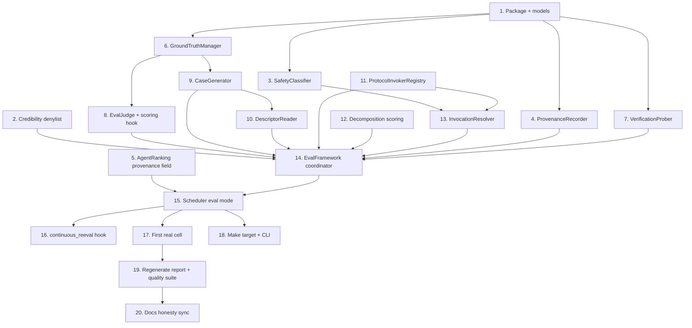

# Implementation Plan

## Overview

This plan builds the Agent Evaluation Framework as an additive layer over the existing benchmark engine, reaching a real `functional_smoke` cell with no new CI network early and the first real scored discovered-agent cell by task 17. The framework reads each agent's own capability descriptor (MCP `tools/list`, A2A Agent Card, OpenAPI operations) to drive test generation, invokes through a pluggable per-protocol registry with honest maturity status (MCP/OpenAPI executable; A2A/ACP/ANP verification-only until invokers exist), and scores with the field-standard tool-use decomposition additively on top of exact-match/judge. Conventions: backend is stdlib `unittest` (no pytest), Ruff-clean (`ruff check apps scripts --fix`), Pydantic models stay in `web/models.py`. New code lives in `apps/api/planmyagents_api/eval/`. Each task is test-first where practical and ends green before the next begins. Ordering is cheapest-first and de-risks the "first real cell" milestone.

## Task Dependency Graph



```json
{
  "waves": [
    {
      "wave": 1,
      "tasks": ["1", "2", "5", "11"],
      "rationale": "Independent foundations: eval data models, the denylist-only credibility change, the backward-compatible AgentRanking field, and the protocol-invoker registry (depends only on existing adapters)."
    },
    {
      "wave": 2,
      "tasks": ["3", "4", "6", "7", "12"],
      "rationale": "Components depending only on package/models from wave 1: SafetyClassifier, ProvenanceRecorder, GroundTruthManager, VerificationProber, and decomposition scoring (extends benchmark/scoring.py)."
    },
    {
      "wave": 3,
      "tasks": ["8", "9", "13"],
      "rationale": "EvalJudge and CaseGenerator build on GroundTruthManager (task 6); InvocationResolver builds on SafetyClassifier (task 3) and the ProtocolInvokerRegistry (task 11)."
    },
    {
      "wave": 4,
      "tasks": ["10"],
      "rationale": "DescriptorReader feeds CaseGenerator (task 9) and is consumed by the coordinator."
    },
    {
      "wave": 5,
      "tasks": ["14"],
      "rationale": "The coordinator composes all components from waves 1-4 plus the credibility change."
    },
    {
      "wave": 6,
      "tasks": ["15"],
      "rationale": "Scheduler eval mode depends on the coordinator (task 14) and the AgentRanking field (task 5)."
    },
    {
      "wave": 7,
      "tasks": ["16", "17", "18"],
      "rationale": "continuous_reeval hook, first-real-cell integration, and the Make/CLI entry all depend on the wired scheduler (task 15) and can proceed in parallel."
    },
    {
      "wave": 8,
      "tasks": ["19"],
      "rationale": "Regenerate the credibility report and run the full quality suite after the first real cell lands (task 17)."
    },
    {
      "wave": 9,
      "tasks": ["20"],
      "rationale": "Docs honesty sync happens only after the regenerated report (task 19) proves the cell is real."
    }
  ]
}
```

## Tasks

- [x] 1. Scaffold the eval package and shared data models
  - Create `apps/api/planmyagents_api/eval/__init__.py` and `eval/models.py`.
  - Implement `EvalRunMode` and `EvalTier` enums, `EvalProvenance`, and `EvalResult` exactly as in the design's Data Models section, with `quality_score: float | None` and `to_json()` on each dataclass.
  - Add the `source` taxonomy as a module-level constant set (`REAL_EVAL_SOURCES = {"exact_match", "judge"}`, `NON_REAL_EVAL_SOURCES = {"verification_only", "dry_run", "gated", "refused"}`).
  - Write unit tests under `apps/api/tests/test_eval_models.py` asserting `EvalResult.quality_score` is `None` for a verification-only construction and `to_json()` round-trips.
  - _Requirements: 1.5, 2.2, 2.4, 6.7_

- [x] 2. Extend the credibility classifier's non-real source set (denylist-only)
  - In `benchmark/credibility.py::_is_real_run`, add `verification_only`, `dry_run`, `gated`, `refused` to the non-real `source` set. Do NOT touch any threshold.
  - Add `apps/api/tests/test_credibility_eval_sources.py`: assert each new value is treated non-real; assert `exact_match` and `judge` with `sample_size > 0` are treated real; assert an existing fixture cell's band is unchanged (Property 3 — monotonicity).
  - _Requirements: 7.1, 7.2, 8.2, 8.3_

- [x] 3. Implement SafetyClassifier with curated table + run-mode gating
  - Create `eval/safety.py` with `SafetyClass`, `SafetyApproval`, `SafetyClassifier`.
  - Implement the seed read-only / side-effecting table from the design; unknown ⇒ `unclassified`.
  - Implement `permitted_run_modes` (unclassified ⇒ `{DRY_RUN}`; side_effecting w/o approval ⇒ no `LIVE`; side_effecting w/ fixture ⇒ `SANDBOX` allowed) and `fixture_for`.
  - Tests in `apps/api/tests/test_eval_safety.py` covering each class, the gating matrix, and that an LLM-proposed class never auto-promotes past `unclassified`.
  - _Requirements: 5.1, 5.2, 5.3, 5.6_

- [x] 4. Implement ProvenanceRecorder and EvalProvenance wiring
  - Create `eval/provenance.py` with `EvalProvenance` and a `ProvenanceRecorder` that builds provenance from a candidate + run context and attaches it to `BenchmarkRun.raw_response["_eval"]`.
  - Resolve `agent_version` from candidate version metadata (MCP/registry/npm version), defaulting to `"unknown"`.
  - Tests in `apps/api/tests/test_eval_provenance.py`: all required fields present; `fixture_ids` populated for a side-effecting context; no credential field present (Property 7).
  - _Requirements: 10.1, 10.2, 10.4, 10.5, 13.2, 13.3_

- [x] 5. Add the optional provenance field to AgentRanking (backward-compatible)
  - In `benchmark/rankings.py`, add `provenance: dict[str, Any] = field(default_factory=dict)` to `AgentRanking` and include it in `to_json()`.
  - Confirm `compute_rankings` still passes `source` through and defaults provenance to `{}`.
  - Extend existing ranking tests to assert the new field defaults empty and round-trips; assert all existing ranking tests still pass.
  - _Requirements: 8.2, 10.1_

- [x] 6. Implement GroundTruthManager (exact-match + none) and versioning
  - Create `eval/ground_truth.py` with `GroundTruthKind`, `GroundTruth`, `GroundTruthManager`.
  - Resolve hand-authored YAML from `packages/benchmarks/<capability>/` to `EXACT_MATCH`; missing ⇒ `NONE` with a recorded reason (rubric path stubbed for task 8).
  - Implement content-hash version ids (`gt:<capability>:<sha8>`); changing cases changes the hash.
  - Tests in `apps/api/tests/test_eval_ground_truth.py`: existing capability resolves exact-match; unknown capability ⇒ `NONE` + reason; version changes when case content changes.
  - _Requirements: 3.1, 3.3, 3.4, 3.5, 3.6_

- [x] 7. Implement VerificationProber producing verification-only results
  - Create `eval/verification.py` with `VerificationProber.probe()` returning a `VerificationOutcome` carrying a canonical `verification_status` from `discovery/normalizer.py`.
  - Gate the live MCP `tools/list` probe behind `enable_live_probe`/protocol gate; when off, derive status from catalogue signals only (no network).
  - Emit a `VerificationRecord`-shaped dict for the `verification_records` store; never emit a scored ranking.
  - Tests in `apps/api/tests/test_eval_verification.py`: gate off ⇒ no network + verification-only; passing probe ⇒ `capability_verified`; result has `quality_score is None` (Property 1).
  - _Requirements: 2.1, 2.5, 6.4, 14.4_

- [x] 8. Implement EvalJudge (identity-blind) and the scoring hook
  - Create `eval/judge.py` with `Rubric`, `JudgeVerdict`, `EvalJudge.score()` using an injected `EscalatingChatClient`.
  - Build the judge prompt from rubric + case inputs + provider OUTPUT only — assert provider id/name/vendor are absent from the message payload.
  - Clamp score to [0,1]; record `judge_model_id` + `rubric_version`; judge-unavailable ⇒ raise a typed error the framework maps to non-eval-able.
  - Add an optional `judge` hook to `benchmark/scoring.py::score_response` that activates when `TestCase.expected` declares a `rubric_version`; exact-match path unchanged.
  - Tests in `apps/api/tests/test_eval_judge.py` (fake chat client): identity-blind payload; clamping; judge-unavailable path; exact-match determinism preserved (Property 9).
  - _Requirements: 4.1, 4.2, 4.3, 4.4, 4.5, 4.6, 4.7_

- [x] 9. Implement CaseGenerator with curated-isolation
  - Create `eval/case_generator.py` with `GeneratedCaseSet` and `CaseGenerator.generate()` emitting `TestCase`-shaped cases from a tool `inputSchema`.
  - Mark generated sets `curated=False`; content-hash version.
  - Provide the curated-isolation guarantee surface the framework will honor (a helper that filters uncurated cases out of any `scored_benchmark` set).
  - Tests in `apps/api/tests/test_eval_case_generator.py`: `TestCase` shape; `curated=False`; version hash; uncurated excluded from a scored set, allowed in smoke (Property 10).
  - _Requirements: 9.1, 9.2, 9.3, 9.4, 9.5, 9.6_

- [x] 10. Implement DescriptorReader (agent-card → normalized operations)
  - Create `eval/descriptor.py` with `OperationSpec`, `CapabilityDescriptor`, and `DescriptorReader.read()`.
  - Implement three parsers into the same `OperationSpec` shape: MCP `tools/list`, A2A Agent Card `skills` array, OpenAPI operation set.
  - Make `CaseGenerator.generate()` consume `OperationSpec` (from task 9) instead of a raw protocol blob, so case-input synthesis is protocol-agnostic.
  - Record `descriptor_source`; record advertised operations that map to no known capability as unmapped (never fabricate a capability).
  - Tests in `apps/api/tests/test_eval_descriptor.py`: each parser → normalized ops; missing descriptor ⇒ non-eval-able for scored with `missing_descriptor`; unmapped operation recorded, not fabricated (Property 12).
  - _Requirements: 15.1, 15.2, 15.3, 15.4, 15.5, 15.6_

- [x] 11. Implement ProtocolInvokerRegistry with per-protocol maturity
  - Create `eval/protocols.py` with `ProtocolMaturity`, `ProtocolInvoker`, `ProtocolInvokerRegistry`.
  - Seed: MCP + OpenAPI = `executable`; A2A = `refusal_only`; ACP + ANP = `planned`.
  - `executable` ⇒ build real adapter; non-`executable` ⇒ verification-only result with synthetic `source` and `quality_score=None`.
  - Tests in `apps/api/tests/test_eval_protocols.py`: registry lookup by protocol; A2A/ACP/ANP never produce a real source or a numeric score (Property 11); registering a new invoker requires no coordinator change.
  - _Requirements: 16.1, 16.2, 16.3, 16.4, 16.5, 16.6, 16.7_

- [x] 12. Implement standards-aligned decomposition scoring
  - Create `eval/decomposition.py` with `StepScore`, `DecompositionResult`, and a scorer for the four steps: decide-to-call, select-operation, build-arguments, integrate-result.
  - Extend `benchmark/scoring.py` so the existing `ScoreResult` is preserved and the decomposition breakdown + trajectory + `scoring_method` are attached as additive run metadata (no scale change).
  - Tests in `apps/api/tests/test_eval_decomposition.py`: per-step scores produced; exact-match composite unchanged and in [0,1] (Property 13); trajectory retained; `scoring_method` recorded.
  - _Requirements: 17.1, 17.2, 17.3, 17.4, 17.5, 17.6_

- [x] 13. Implement InvocationResolver with cost/latency/rate-limit/idempotency
  - Create `eval/invocation.py` with `InvocationDecision` (`Executable` / `Refused`), `HostRateLimiter`, and `InvocationResolver.resolve()`, resolving the adapter via the `ProtocolInvokerRegistry` (task 11) — no protocol branches here.
  - For `executable` surfaces, wrap the invoker's adapter in a decorator that: checks `cost_cap` before the call (refuse on exceed), enforces the latency budget (timeout ⇒ structured result), applies the rate limiter, and injects an idempotency key derived from `(provider_id, capability, case_id)` only.
  - Honor the protocol gate: gate off ⇒ `Refused("gate_disabled", source="gated")`. Safety-blocked ⇒ `Refused(..., source="refused")`. Non-`executable` protocol ⇒ structured refusal. BYO-creds live ⇒ `Refused("sandbox_unavailable")` while `sandbox_runner` is a stub.
  - Tests in `apps/api/tests/test_eval_invocation.py` with an injected fake transport: gate off; cost-cap exceed; latency timeout; idempotency key present and secret-free; rate limiter invoked; A2A refusal.
  - _Requirements: 5.7, 11.1, 11.2, 11.3, 11.4, 11.5, 13.1, 13.4, 13.5, 14.1, 14.2, 14.3, 16.3_

- [x] 14. Implement the EvalFramework coordinator (tier ladder + degradation)
  - Create `eval/framework.py` with `EvalFramework.evaluate_cell()` orchestrating: provider-type guard ⇒ safety classify ⇒ static_verification ⇒ descriptor read ⇒ protocol resolve (registry) ⇒ ground-truth resolve ⇒ run+score ⇒ provenance ⇒ assemble `EvalResult`.
  - Implement cheapest-first ordering, stop-on-cheaper-tier-failure, and graceful degradation to verification-only with absent quality; non-`executable` protocol ⇒ verification-only.
  - Ensure every exit path returns an `EvalResult` (no exceptions escape) and sets provider_type, protocol, protocol_maturity, descriptor_source, tier_reached, run_mode, safety_class, source, scoring_method.
  - Tests in `apps/api/tests/test_eval_framework.py`: non-agentic ⇒ error result; no-surface ⇒ verification-only; no-ground-truth ⇒ non-eval-able; A2A ⇒ verification-only (Property 11); happy path (fake MCP adapter) ⇒ scored result with real source; total-failure handling (Property 8); Properties 1, 4, 6 asserted here.
  - _Requirements: 1.1, 1.2, 1.3, 1.4, 1.6, 1.7, 2.1, 2.3, 6.1, 6.2, 6.3, 6.5, 6.7, 7.3, 7.4, 7.6, 7.7, 12.2, 15.4, 16.1_

- [x] 15. Wire eval mode into BenchmarkScheduler (no fork)
  - Extend `benchmark/scheduler.py`: add `eval_framework: EvalFramework | None = None` and a `run_mode` param to `run()`.
  - Change `_resolve_adapter` so that, when `eval_framework` is present and the protocol gate + safety permit, a generic-protocol candidate is evaluated via the framework instead of returning the `protocol_beta` skip; tag ranking `source` by eval basis.
  - Preserve the existing per-candidate try/except, retag-by-candidate, status aggregation, and `SchedulerReport` (failure isolation).
  - Keep reads through `RoutingDiscoveryStore`; keep baselines out of routing.
  - Tests in `apps/api/tests/test_eval_scheduler.py`: gate on + fake MCP adapter ⇒ candidate scored (not skipped); one candidate raises ⇒ batch summary still complete (Property 8); baseline never routed.
  - _Requirements: 8.1, 8.2, 8.4, 8.5, 8.6, 8.7, 12.1, 12.3, 12.4_

- [x] 16. Add continuous_reeval scheduling hook
  - Add a selection mode to the scheduler/CLI that picks previously-scored eval cells whose `last_run_at` age approaches `credibility.max_run_age_days` and re-runs them, refreshing `last_run_at`.
  - Tests asserting a stale cell is selected for re-eval and a fresh cell is not; assert re-run updates `last_run_at`.
  - _Requirements: 6.6, 6.7_

- [x] 17. Author the first real cell: one read-only MCP capability end-to-end
  - Pick one read-only capability with deterministic ground truth (e.g., `web_scraping` against an RFC-2606 reserved domain) and ensure curated exact-match cases exist (N≥30 across difficulties).
  - Add a local HTTP MCP stub fixture under `apps/api/tests/fixtures/` that answers `tools/list` + `tools/call` deterministically, so the full path is testable in CI without external network.
  - Integration test in `apps/api/tests/test_eval_first_cell.py`: with the gate env set in-test, the framework reads the stub's descriptor, scores it, and persists real `BenchmarkRun`s + an `AgentRanking` with `source=exact_match`.
  - Assert a generated credibility report moves that capability off `synthetic_only` (to at least `smoke_test`).
  - _Requirements: 6.5, 7.7, 8.1, 8.2, 8.3, 10.3, 15.1_

- [x] 18. Add the cron-driven eval worker (CLI + make targets)
  - Create `scripts/run_eval_scheduler.py` mirroring `scripts/run_benchmark_scheduler.py` scaffolding (path insert → argparse → `discovery_store_for_path`/`benchmark_store_for_path` → run → JSON summary → exit 0 when nothing due).
  - Add `make eval-schedule`, `make eval-cron`, and `make eval-schedule-smoke` mirroring the `benchmark-*` targets; default `--run-mode dry_run`; honor the protocol gate.
  - Extend the composite `evidence-cron` target to also run `eval-cron` so eval runs on the same cron tick as benchmark + verification, and surface eval real-cell counts through the existing `evidence_health` view.
  - Tests for arg parsing + dry-run default; assert dry-run performs no live call; assert exit 0 when no candidates are due (idempotent cron).
  - _Requirements: 5.5, 8.4, 14.4_

- [x] 19. Regenerate the credibility report and run the full quality suite
  - Run `make benchmark-credibility-report` and confirm the first real cell is reflected honestly (band reflects real-run data, not synthetic).
  - Run `make test-fast` (deterministic subset) and `ruff check apps scripts --fix`; fix any failures.
  - Confirm `reports/benchmark-credibility/{date}.md` is regenerated; do not hand-edit it.
  - _Requirements: 7.2, 7.5, 8.3_

- [x] 20. Update docs to reflect the now-real capability (honesty sync)
  - Update `docs/honest-scope-audit.md`, `sprint.md`, `README.md` status rows, and the `PITCH_DECK.md` benchmark row to reflect "first real discovered-agent cell landed" — only once task 17/19 actually pass.
  - Note the protocol coverage honestly (MCP/OpenAPI executable; A2A/ACP/ANP verification-only) so no surface overclaims multi-protocol scoring.
  - Keep AGENTS.md Hard Rule #1 compliance: claims must match the regenerated credibility report exactly.
  - _Requirements: 7.1, 7.2, 16.5_

## Notes

- Tasks 1–13 are pure unit work with no network and can land in `make test-fast`; they unblock the coordinator (task 14).
- The framework reads the agent's own capability descriptor (task 10) so test generation reflects what each agent advertises, not a hand-mapped slug — this is what makes it apply broadly to future discovered agents.
- Protocol invocation is a plugin registry (task 11) with honest maturity status: MCP and OpenAPI are `executable`; A2A is `refusal_only`; ACP (merged into A2A under the Linux Foundation) and ANP (DID/JSON-LD open-network discovery) are `planned`. Non-executable protocols yield verification-only results and never a fabricated score (Property 11). Adding a protocol later is registering an invoker plus tests — no coordinator change.
- Scoring follows the field-standard four-step tool-use decomposition (task 12) additively; the composite stays on the 0.0–1.0 scale the classifier consumes, so no thresholds change.
- The protocol execution gate (`PLANMYAGENTS_ENABLE_PROTOCOL_ADAPTER_EXECUTION`) stays default-off; task 17's integration test sets it in-process against a local stub only.
- Credibility thresholds are never edited; the only classifier change is the denylist widening in task 2 (Property 3 protects against overclaim).
- Docs (task 20) change only after the regenerated credibility report proves the cell is real, per AGENTS.md Hard Rule #1.

