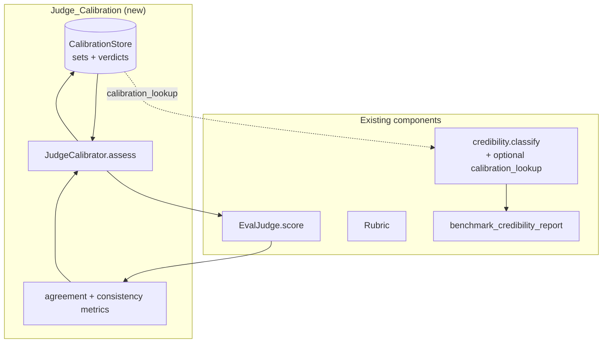
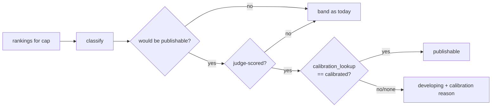

# Design Document

## Overview

Judge_Calibration measures whether the Eval_Judge can be trusted for a given capability — by comparing its scores against a human-labeled reference set — and gates judge-scored leaderboards on the result. A judge-scored capability may reach the `publishable` credibility band only if its judge is `calibrated` (agrees with humans closely enough, and is self-consistent). This closes the credibility gap named in the honest-scope audit: a judge-scored leaderboard otherwise rests on an unvalidated scorer.

This is additive and reuse-first. It introduces two small new pieces — a `CalibrationStore` (mirroring the existing store factories) and a `JudgeCalibrator` (orchestrator) — and one **backward-compatible** hook into the existing credibility classifier. It reuses:

| Need | Existing component |
|---|---|
| Score an output against a rubric | `EvalJudge.score(...)` (`eval/judge.py`) |
| Rubric shape + criteria | `Rubric` (`eval/ground_truth.py`) |
| Credibility banding | `benchmark/credibility.py::classify` (extended, thresholds untouched) |
| Store factory pattern | `verification_store_for_path` / `run_event_store_for_path` style |
| "judge" vs "exact_match" basis | the `source` field already on every ranking |
| Report generation | the existing `benchmark_credibility_report` script |

The exact-match path is untouched: exact-match capabilities need no judge, so the gate never applies to them.

## Design decisions and rationale

1. **The gate is a downgrade hook, not a threshold change.** `classify()` gains an optional `calibration_lookup: Callable[[str], CalibrationVerdict | None] = None`. When a capability would be `publishable` AND it is judge-scored AND the lookup says its judge is not `calibrated`, the result is downgraded to `developing` with a calibration reason. Default `None` ⇒ today's behavior exactly. This satisfies Requirement 4.4 (no numeric threshold change) and keeps every existing caller and test valid.

2. **"Judge-scored capability" is read off the rankings, not configured.** A capability is judge-scored when its real rankings carry `source == "judge"` — the same `source` taxonomy the framework already persists. No new flag. A capability scored only by `exact_match` is never gated (Requirement 4.3); a mixed capability is gated only on its judge basis (Requirement 4.6 — see "Mixed-basis handling").

3. **Calibration scores already-captured outputs, never live agents.** A `CalibrationItem` carries the agent output that a human already labeled. Assessment re-runs the judge over those fixed outputs and compares to the human labels. So calibration makes **no provider call** (Requirement 6.3) and is fully deterministic with an injected judge (Requirement 6.1).

4. **Two metrics, both required.** Agreement (mean absolute error vs human labels; lower is better) catches a judge that is accurate-on-average; Consistency (score dispersion across repeated runs of the same item; lower is better) catches a judge that is unstable. A judge must pass BOTH plus a minimum set size to be `calibrated` (Requirement 3.2). Conservative defaults, env-overridable like the credibility thresholds.

5. **Labels are hidden from the judge.** The judge sees only the rubric + case input + agent output (the same identity-blind payload `EvalJudge` already builds). Human labels live only in the calibration store and the metric computation — never in the judge prompt (Requirement 2.6).

6. **Fail-closed on judge-unavailable.** If the judge can't run, the verdict is `not_assessed`, never `calibrated` (Requirement 2.5). A `not_assessed` verdict caps `publishable` exactly like `uncalibrated` — absence of proof is not proof.

## Architecture



### Assessment sequence

```mermaid
sequenceDiagram
    participant Op as Operator (CLI)
    participant C as JudgeCalibrator
    participant S as CalibrationStore
    participant J as EvalJudge (reused)
    Op->>C: assess(capability)
    C->>S: load Calibration_Set(capability)
    alt no set
        C-->>Op: Verdict(not_assessed, "no calibration set")
    else set present
        loop each item (labels hidden from judge)
            C->>J: score(rubric, case_input, agent_output)
            J-->>C: judge_score
        end
        C->>J: re-score k items (consistency)
        C->>C: agreement = MAE(judge, human); consistency = dispersion
        C->>S: persist CalibrationVerdict (+ metrics + thresholds)
        C-->>Op: Verdict(calibrated | uncalibrated, metrics)
    end
```

### Gate at classification time



## Data Models

The new types live in `eval/calibration.py` (new). No existing persisted schema changes; the calibration store adds its own JSON/Postgres tables via the existing factory pattern.

```python
@dataclass(frozen=True)
class CalibrationItem:
    case_id: str
    capability: str
    case_input: dict[str, Any]
    agent_output: dict[str, Any]
    human_label: float            # 0.0-1.0

@dataclass(frozen=True)
class CalibrationSet:
    capability: str
    rubric_version: str
    items: list[CalibrationItem]
    version: str = ""             # content hash; auto if empty

@dataclass(frozen=True)
class CalibrationThresholds:
    max_mean_abs_error: float = 0.15     # judge within 0.15 of humans on avg
    max_score_dispersion: float = 0.10   # repeat-run std/spread ceiling
    min_set_size: int = 20
    # env overrides: PLANMYAGENTS_JUDGE_CAL_MAX_MAE / _MAX_DISPERSION / _MIN_SET

@dataclass(frozen=True)
class CalibrationVerdict:
    capability: str
    status: str                   # calibrated | uncalibrated | not_assessed
    mean_abs_error: float
    score_dispersion: float
    set_size: int
    judge_model_id: str
    rubric_version: str
    assessed_at: str
    reasons: list[str] = field(default_factory=list)
    unblockers: list[str] = field(default_factory=list)

    @property
    def is_calibrated(self) -> bool:
        return self.status == "calibrated"
```

## Components and Interfaces

### JudgeCalibrator — `eval/calibration.py`

```python
@dataclass
class JudgeCalibrator:
    judge: EvalJudge
    store: CalibrationStore
    thresholds: CalibrationThresholds = field(default_factory=CalibrationThresholds)
    consistency_repeats: int = 3

    def assess(self, capability: str, *, rubric: Rubric | None = None) -> CalibrationVerdict: ...
    def assess_all(self) -> dict[str, CalibrationVerdict]: ...   # failure-isolated per cap
```

- `assess`: load the `CalibrationSet`; if none → `not_assessed` (R1.5). Run `EvalJudge.score(rubric, output, input)` per item (labels NOT passed — R2.6). MAE vs human labels (R2.2). Re-score `consistency_repeats` items, measure dispersion (R2.3). Apply thresholds → `calibrated` only if MAE ≤ cap AND dispersion ≤ cap AND set_size ≥ min (R3.2). Record metrics + thresholds + judge model + rubric version (R2.4, R3.4). Persist verdict (R3.6). Judge unavailable → `not_assessed` + reason (R2.5).
- `assess_all`: iterate capabilities with a set; one capability raising → `not_assessed` for it, continue (R6.2).

The rubric comes from the same source the framework uses (`GroundTruthManager` rubric-shaped cases or a registered `Rubric`); when not supplied, build it from the calibration set's `rubric_version`.

### CalibrationStore — `eval/calibration_store.py` (new, mirrors existing factories)

```python
class JsonCalibrationStore:   # sets + verdicts in one JSON doc
    def save_set(self, s: CalibrationSet) -> None: ...
    def load_set(self, capability: str) -> CalibrationSet | None: ...
    def save_verdict(self, v: CalibrationVerdict) -> None: ...
    def latest_verdict(self, capability: str) -> CalibrationVerdict | None: ...

class PostgresCalibrationStore: ...   # same interface

def calibration_store_for_path(path) -> ...:   # postgres:// → PG else JSON
```

Mirrors `verification_store_for_path` exactly. Versions are content hashes (R1.3, R1.4). No credential persisted (R6.4).

### Credibility gate hook — `benchmark/credibility.py` (extended, backward-compatible)

```python
def classify(
    *, capability, candidates, rankings,
    thresholds=None, now=None,
    calibration_lookup: Callable[[str], "CalibrationVerdict | None"] | None = None,  # NEW
) -> CredibilityVerdict: ...
```

Only change to logic: at the point the function is about to return `publishable`, if the capability is judge-scored (any real ranking row has `source == "judge"`) and `calibration_lookup(capability)` is not `calibrated`, return `developing` instead, appending a calibration reason + unblocker. `calibration_lookup=None` ⇒ unchanged behavior (every existing call site and test passes untouched). No numeric threshold is altered (R4.4). To avoid an import cycle, the hook is typed structurally — it only reads `.is_calibrated` / `.status` off whatever the lookup returns.

A tiny helper `_is_judge_scored(rankings_for_cap)` returns True when any real row's `source == "judge"`. Mixed-basis handling: if both `exact_match` and `judge` real rows exist, the gate applies (the published number would include judge-derived scores), but the reason notes the exact-match basis is unaffected (R4.6).

### Report + CLI

- `benchmark_credibility_report` (existing script) gains a calibration column for judge-scored capabilities by passing a `calibration_lookup` backed by `calibration_store_for_path`. Exact-match rows are unchanged (R5.4).
- New `scripts/benchmark/run_judge_calibration.py` (mirrors `run_benchmark_scheduler.py`): `--capability` (or all), resolves the judge + calibration store, runs `assess`, prints + persists verdicts. Make target `judge-calibration`.

## Mixed-basis handling

A capability is "judge-scored" for the gate if any real ranking row carries `source == "judge"`. Rationale: the published composite for that capability would then incorporate judge-derived scores, so the calibration gate must apply. The reason string records that exact-match providers in the same capability are not themselves penalized — the cap is on the *publishable claim for the capability*, which is the honest unit.

## Error Handling

| Condition | Behavior | Requirement |
|---|---|---|
| No calibration set for capability | `not_assessed`, gate caps publishable | R1.5, R4.2 |
| Judge unavailable during assess | `not_assessed` + reason, never `calibrated` | R2.5 |
| One capability errors in `assess_all` | recorded `not_assessed`, others continue | R6.2 |
| `calibration_lookup` returns None for a judge-scored cap | treated as not-calibrated → capped to `developing` | R4.2 |
| Exact-match-only capability | gate never consulted; classified as today | R4.3 |

## Correctness Properties

### Property 1: No publishable judge leaderboard without a calibrated judge
For any judge-scored capability, `classify(... calibration_lookup=L)` returns `publishable` only if `L(capability).is_calibrated` is True. A `not_assessed` or `uncalibrated` verdict caps the band at `developing`.

**Validates: Requirements 4.1, 4.2, 5.3**

### Property 2: Exact-match path unaffected
For any capability whose real rankings contain no `source == "judge"` row, `classify` returns the identical band with or without `calibration_lookup`.

**Validates: Requirements 4.3, 4.4, 5.4**

### Property 3: Calibrated requires agreement AND consistency AND size
`assess` returns `calibrated` only when `mean_abs_error <= max_mean_abs_error` AND `score_dispersion <= max_score_dispersion` AND `set_size >= min_set_size`. Failing any one yields `uncalibrated`.

**Validates: Requirements 3.2**

### Property 4: Labels never reach the judge
During `assess`, the payload handed to `EvalJudge.score` contains the rubric, case input, and agent output only — never the human label.

**Validates: Requirements 2.6**

### Property 5: Fail-closed on unavailability
If the judge cannot produce a score, the verdict is `not_assessed`, never `calibrated`.

**Validates: Requirements 2.5**

### Property 6: Deterministic with an injected judge
Two `assess` runs with the same calibration set, thresholds, and a deterministic injected judge produce the same verdict.

**Validates: Requirements 6.1**

### Property 7: No live calls, no credentials
`assess` makes no provider invocation (it scores captured outputs) and persists no credential value.

**Validates: Requirements 6.3, 6.4**

## Testing Strategy

Stdlib `unittest`; deterministic injected judge (the same fake-judge pattern as `test_eval_rubric_path.py`); no network.

**Unit:**
- Metrics: MAE and dispersion computed correctly on known inputs.
- Thresholds: pass requires all three (agreement, consistency, size); each one failing → `uncalibrated`.
- `not_assessed`: no set → not_assessed; judge raising → not_assessed (fail-closed).
- Labels hidden: assert the human label is absent from the judge call payload.
- Store: set + verdict round-trip; content-hash version changes on edit.
- Determinism: same inputs + deterministic judge → identical verdict.

**Credibility gate:**
- Judge-scored cap that would be `publishable`: `calibrated` → stays publishable; `uncalibrated`/`not_assessed`/lookup-None → `developing` with calibration reason.
- Exact-match cap: band identical with and without `calibration_lookup` (Property 2).
- Mixed-basis cap: gate applies; reason notes exact-match basis unaffected.
- Regression: all existing `test_credibility.py` cases pass unchanged (default `calibration_lookup=None`).

**Integration:**
- End-to-end: build a small calibration set for `return_policy_analysis` (reuse the worked example outputs), assess with the deterministic judge, persist verdict, then classify the capability with the lookup and assert the band reflects the verdict.

## Requirements coverage map

| Requirement | Primary design element |
|---|---|
| R1 Human-labeled set | `CalibrationItem`/`CalibrationSet` + `CalibrationStore` + content-hash version |
| R2 Agreement + consistency | `JudgeCalibrator.assess` MAE + dispersion; labels hidden; fail-closed |
| R3 Verdict + thresholds | `CalibrationVerdict` + `CalibrationThresholds` (env-overridable) |
| R4 Gate in classifier | `classify(calibration_lookup=...)` downgrade hook; thresholds untouched |
| R5 Reporting/honesty | report calibration column; publishable blocked until calibrated |
| R6 Determinism/isolation/safety | injected judge determinism; per-cap failure isolation; no live call/creds; reuse-only |
