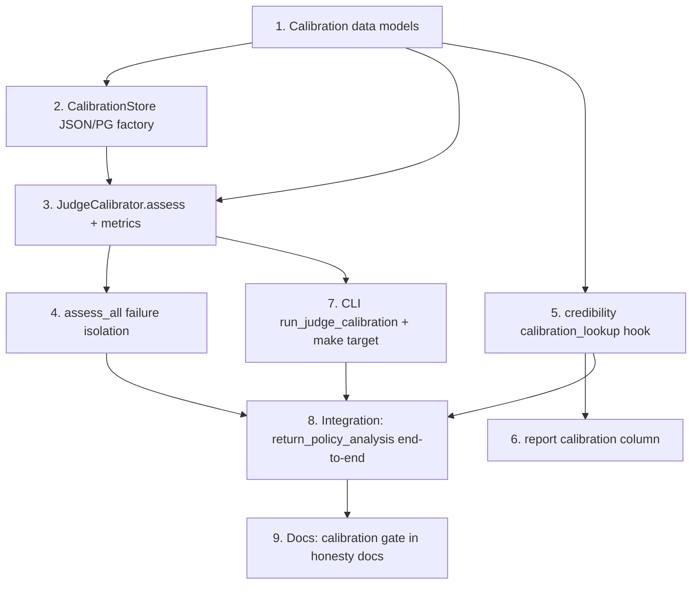

# Implementation Plan

## Overview

Build the judge-calibration gate: measure the Eval_Judge against a human-labeled reference set per capability, and cap judge-scored leaderboards below `publishable` until the judge is `calibrated`. Reuse-first — extends the credibility classifier with a backward-compatible `calibration_lookup` hook and adds a `CalibrationStore` + `JudgeCalibrator`, reusing `EvalJudge`, `Rubric`, and the store-factory pattern. Conventions: stdlib `unittest`, Ruff-clean, no new third-party deps, deterministic injected judge in tests (same fake-judge pattern as `test_eval_rubric_path.py`).

## Task Dependency Graph



```json
{
  "waves": [
    { "wave": 1, "tasks": ["1"], "rationale": "Data models underpin store, calibrator, and the gate hook." },
    { "wave": 2, "tasks": ["2", "5"], "rationale": "Store and the credibility hook depend only on the models and can proceed in parallel." },
    { "wave": 3, "tasks": ["3"], "rationale": "JudgeCalibrator.assess depends on models + store." },
    { "wave": 4, "tasks": ["4", "6", "7"], "rationale": "assess_all, report column, and CLI depend on assess / the hook." },
    { "wave": 5, "tasks": ["8"], "rationale": "End-to-end integration depends on the full path." },
    { "wave": 6, "tasks": ["9"], "rationale": "Docs once the gate is real and tested." }
  ]
}
```

## Tasks

- [ ] 1. Add calibration data models
  - Create `apps/api/planmyagents_api/eval/calibration.py` with `CalibrationItem`, `CalibrationSet` (content-hash `version`), `CalibrationThresholds` (env-overridable), and `CalibrationVerdict` (with `is_calibrated`), exactly as in the design.
  - Unit test `apps/api/tests/eval/test_calibration_models.py`: verdict `is_calibrated`; set version is a content hash that changes on edit; thresholds read env overrides.
  - _Requirements: 1.1, 1.3, 1.4, 3.1, 3.3_

- [ ] 2. Implement CalibrationStore (JSON + Postgres factory)
  - Create `apps/api/planmyagents_api/eval/calibration_store.py` with `JsonCalibrationStore`, `PostgresCalibrationStore`, and `calibration_store_for_path`, mirroring `verification_store_for_path`. Persist sets + verdicts; never persist a credential.
  - Tests: set + verdict round-trip in JSON store; `latest_verdict` returns the newest; factory picks PG for `postgres://`.
  - _Requirements: 1.2, 6.4_

- [ ] 3. Implement JudgeCalibrator.assess + metrics
  - In `eval/calibration.py`, implement `JudgeCalibrator.assess(capability, rubric=None)`: load set (none → `not_assessed`); run `EvalJudge.score` per item with labels HIDDEN; compute MAE (agreement) and repeat-run dispersion (consistency); apply thresholds → `calibrated` only if all three pass; persist verdict with metrics + thresholds + judge model + rubric version.
  - Judge unavailable → `not_assessed` + reason (fail-closed, never `calibrated`).
  - Tests `apps/api/tests/eval/test_judge_calibration.py` (deterministic injected judge): calibrated when agreement+consistency+size pass; each failing → uncalibrated; no set → not_assessed; judge raises → not_assessed; assert human label absent from the judge call payload; determinism (same inputs → same verdict).
  - _Requirements: 2.1, 2.2, 2.3, 2.4, 2.5, 2.6, 3.2, 3.4, 3.5, 3.6, 6.1, 6.3_

- [ ] 4. Add assess_all with per-capability failure isolation
  - Implement `assess_all()` iterating every capability that has a calibration set; one capability raising → recorded `not_assessed`, others continue.
  - Tests: a set that errors during assess yields `not_assessed` for that capability without aborting the batch.
  - _Requirements: 6.2_

- [ ] 5. Add the calibration_lookup hook to the credibility classifier
  - Extend `benchmark/credibility.py::classify` with optional `calibration_lookup` (default None ⇒ unchanged). Add `_is_judge_scored(rankings_for_cap)`. When the result would be `publishable` AND the capability is judge-scored AND the lookup is not `calibrated`, downgrade to `developing` and append a calibration reason + unblocker. Do not change any numeric threshold.
  - Tests `apps/api/tests/benchmark/test_credibility_calibration_gate.py`: judge-scored + calibrated → publishable; + uncalibrated/not_assessed/None → developing with calibration reason; exact-match cap identical with/without lookup (Property 2); mixed-basis cap gated with the exact-match-unaffected note; all existing `test_credibility.py` cases still pass (default None).
  - _Requirements: 4.1, 4.2, 4.3, 4.4, 4.5, 4.6, 5.3_

- [ ] 6. Surface calibration in the credibility report
  - Update `scripts/benchmark/benchmark_credibility_report.py` to pass a `calibration_lookup` backed by `calibration_store_for_path` and show each judge-scored capability's calibration verdict. Exact-match rows unchanged.
  - Tests: report includes a calibration column/line for a judge-scored capability; exact-match output unchanged.
  - _Requirements: 5.1, 5.2, 5.4_

- [ ] 7. Add the CLI and make target
  - Create `scripts/benchmark/run_judge_calibration.py` mirroring `run_benchmark_scheduler.py`: `--capability` (or all), resolve judge + calibration store, run `assess`/`assess_all`, print + persist verdicts, exit 0. Add `make judge-calibration` and `.PHONY`.
  - Tests: CLI arg parsing; runs `assess_all` against a temp store and prints verdicts.
  - _Requirements: 5.1_

- [ ] 8. End-to-end integration on return_policy_analysis
  - Build a small `CalibrationSet` for `return_policy_analysis` from the worked-example outputs (reuse the rubric-shaped cases + the deterministic fake judge). Assess → persist verdict → classify the capability with the lookup and assert the band reflects the verdict (calibrated → publishable-eligible; uncalibrated → capped).
  - Assert no live provider call is made during calibration.
  - _Requirements: 4.1, 4.2, 6.3_

- [ ] 9. Document the calibration gate in the honesty docs
  - Update `docs/honest-scope-audit.md` and `sprint.md`: judge-scored leaderboards cannot reach `publishable` until the judge passes calibration (agreement + consistency vs a human-labeled set); cross-link the eval-framework spec. State plainly that judge calibration is the credibility gate for open-ended capabilities.
  - _Requirements: 5.3_

## Notes

- The gate is a downgrade hook, not a threshold change: `calibration_lookup=None` preserves today's behavior exactly, so every existing credibility test passes untouched.
- Calibration scores already-captured agent outputs (in the calibration set), never live agents — so it makes no provider call and is deterministic with an injected judge.
- Human labels are never shown to the judge during assessment (Property 4).
- Reuse-first: `EvalJudge`, `Rubric`, the credibility classifier, the store-factory pattern, and the report script are all reused; the only new modules are `calibration.py` and `calibration_store.py`.
- This is the credibility gap correctly named: a judge-scored "publishable" leaderboard is only honest once the judge is validated against humans.
